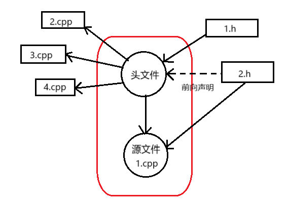
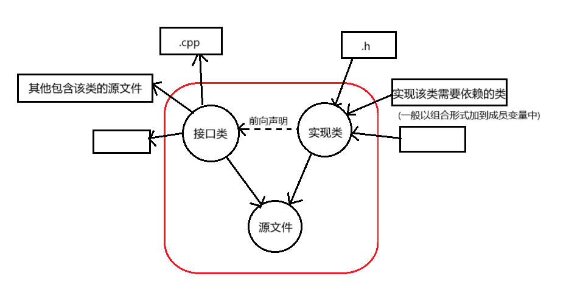

## C编译链接系统

> 先来回顾C语言的编译流程 : 预处理 -> 编译 -> 汇编 -> 链接

### Preprocessor 预处理 

- 输入  .c / .cc 文件
- 输出  .i (intermediate 中间) 文件
- 工作 : 
  - 将include字段用对应的.h文件替换
  - 替换define字段
  - 处理条件编译
  - 删除注释 

### Compiler 编译

- 输入 .i 文件
- 输出 .s (source 源码) 文件
- 工作 :  进行编译层面的语法优化 + 转化为汇编语言. 其内部实现其实相对复杂, 编译器会分析你所构建的类或函数, 在内部生成类似语义树的结构, 进而推动高级代码向汇编代码的转变.

### Assembler 汇编

- 输入 .s 文件
- 输出 .o (object 目标) 文件
- 工作 : 将汇编语言转化为适合的**目标机器码**(也就是CPU可以理解并且执行的二进制码).
- 注意 : 汇编语言有多种, CPU也有不同的目标机器码, 前两个阶段都根据不同的机器/环境做出变化.

### Linker 链接

- 输入 .o 文件

- 输出可执行文件

- 工作 : 实现多文件的链接, 将.o文件中需要的外部资源通过搜索查找等途径填充, 由预处理阶段替换的.h字段引导.

  - 符号解析 / 重定位 : 为.o文件中引用但未定义的函数或变量在外部文件找到定义.

  - **节段机制** : 

    学过进程地址空间就会直到, 每个进程地址空间都会被分配代码块, 数据块等字段用于进程运作, 链接器会利用节段机制将不同.cc文件的数据和代码汇聚到进程地址空间的`.test` / `.data` / `.bss` 等中, 实际就是将分散的源代码汇聚到一个进程体系中, 使其可以作为一个进程真正实现运行.

> 上述过程可以简单理解为 高级语言 -> 汇编语言 -> 目标机器码 -> 代码合并 + 进程实现 
>
> 我们一般统称前三个阶段`预处理->编译->汇编`为编译阶段, 最后一步为链接阶段.
>
> 下面是一些基础概念的讲解 :

### 翻译单元(TU)

可以理解为**一个`.o`文件就是一个翻译单元**, 而一个`.o`又对应一个`.cpp`, 也就是说一个项目`.cpp`文件的数量就是最后翻译单元的数量.

官方点说, 翻译单元就是源文件通过前三个阶段得来的展开代码, 而最后一个阶段就是把各个编译单元链接到一块的过程.

- **编译阶段每个翻译单元相互独立, 而链接阶段会汇聚所有翻译单元产生的`.o`文件**.

### 增量编译

通常编译器会缓存`.o`文件, 只有当`.o`文件对应的`.cpp`文件发生了修改(其包含的头文件发生修改也算), 才会重新进行编译, 不然都会直接使用原来的.o文件而不进行额外的编译, 这是后面前向声明的前置机制.

### 头文件(.h)与源文件(.cpp)分离

这是一个非常基础的理念, 但是在这里重申一下, 首先这种分块的形式便于项目模块的分类和规划, 提供给外部使用也更方便. 但在编译角度, 这种形式可以天然降低重复编译 : 如果`.cpp`文件发生变化, 只要`.h`文件不变, 那么其他包含了该`.h`文件的`.cpp`文件就无需重新编译, 只需要发生变动的这个`.cpp`文件重新编译即可.

### 符号表

C内部有各种各样的符号表, 这里专门讲解在`.o`文件中的符号表, 不过就算是讲解, 也只是表达概念而不是深入底层, 因为其内部实现相对复杂, 不好理解.

- 符号 : 你可以理解为对函数/类/变量的简称, 一般就是其名称再加一些标志符号.

- `.o`文件中的符号表 约等于 **本目标文件对外的接口清单 + 对外的依赖清单**.

- 在链接器拿到`.o`文件后就会知道其有什么样接口, 可以供其他文件使用; 同时也知道其有怎样的依赖, 需要链接器帮它找这些依赖文件.
- 一般`T`被用于表示**拥有其定义**, `U`被用于表示**引用但未定义**需要链接器帮忙寻找, 还有很多标志这里不详述.

### 静态库( .a / .lib )

这是一种用于**存储`.o`文件**的形式. 

- 目的 : 通过存储集合`.o`文件到`.a`中, **在链接阶段直接使用现成的`.o`文件**而直接跳过编译阶段, 大大提升编译速度.

- 生成 : 下面主要展示Linux系统中如何生成静态库, 一般都是使用`ar`进行静态库相关操作.

  ```bash
  # 1. 生成目标文件
  gcc -c add.c sub.c
  # 2. 归档成静态库
  ar rcs libmath.a add.o sub.o
  ```

- 使用 : 生成的静态库名为`libmath.a`, 那么其真正库名就是`math`, 链接时需要`-l库名`.

  ```bash
  # 3. 使用静态库链接
  gcc main.c -L. -lmath -o main_static
  ```

- 底层实现 : 在链接过程中, 链接器会**把需要的`.o`文件拷贝到可执行文件的代码段**.

- 更新 : 在头/源文件发生变动时, 需要重新编译`.o`文件, 再将其重新加入静态库中, 如果原来有就会覆盖.

  ```bash
  # 将 add.o 归并到 math 库中
  ar rcs libmath.a add.o
  ```

### 动态库( .so / .dll )

同样也是一种存储`.o`文件的形式, 其与静态库的差异主要在使用方式.

- 目的 : 和静态库相同, 也是直接使用现成的`.o`文件跳过编译阶段, 但是其具体实现有很大差异.

- 生成 : 

  ```bash
  # 编译为位置无关代码
  gcc -fPIC -c add.c sub.c
  # 链接成动态库
  gcc -shared -o libmath.so add.o sub.o
  ```

- 使用 : 与静态库一致.

  ```bash
  gcc main.c -L. -lmath -o main
  ```

- 更新 :  动态库没有静态库类似的归并动作, 直接文件替换就行, 但是需要考虑链接问题 : 

  ```bash
  # 直接新增或替换
  cp libmath.so.1.0.1 /usr/lib/  
  # 将原本的链接导向新动态库
  ln -sf libmath.so.1.0.1 /usr/lib/libmath.so.1
  ```

- 底层实现 : 

  在连接过程中, 链接器**会告诉可执行文件需要的`.o`文件在哪里**, **不进行实际的拷贝, 而是让可执行文件在运行时将其加载到内存中, 可执行文件到内存中去找**.

- 优势 : 

  - 加载到内存的动态库可以被共享, 也就是说只进行一次到内存的加载即可, **内存占用低**.
  - 动态库可以理解为可执行文件的外部依赖, 但并无实际关联, 动态库的更新无需可执行文件重新编译, **更新便捷**.

- 劣势 : 虽然更新便捷, 但是事实上会带来很多版本兼容性问题.

- 问题 : 如果加载时找不到动态库, 一般会显示`undefined symbol`, 其实就是运行时找不到有对应定义的动态库文件. 一般可以通过查找其对应的动态库文件是否存在, 设置环境变量帮助编译器找到对应的动态库来实现. 

---


## C++编译链接系统

### 前向声明

> 前向声明在C中就存在, 不过在C++中重要性被进一步提升了, 这里就放入了C++部分.

用来**降低编译依存性**的最主要手段, 可以大大减少编译时间.

> 有关编译依存性在我往期博客 Effective C++ 系列中提到过, 后面也会深入讲解.

- 什么是编译依存性?

  一个头文件如果修改, 那么所有使用其的源文件就都要重新编译, 由于头文件很大可能是一个套一个的, 一个头文件的修改就会引发非常多的源文件需要重新编译, 这就是编译依存性, 而前向声明可以极大降低这种危害.

- 什么是前向声明? 

  - 在头文件中对函数进行声明, 可以视为一种最基础的前向声明, 表明在源文件中有其定义, 实现了函数声明与定义的解耦.

  - 还有一种**class的前向声明**, 形式为`class PersonImpl;`保证有这样一个类型, 实现了类型声明与定义的解耦.

    但是最为重要的是, 使用class前向声明有一个必须的前置规则 : 

    - **不可以访问该class的成员**或**执行需要知晓该class大小的行为(如建立实参等)**.

    因为以上两种行为代表编译器必须要知道class的定义才能实现, 使用定义必须包含头文件而非前向声明.

    不过一般也不需要记"不可以"怎样, 这里给出两种"可以"的情况 : 

    - **只使用指针或引用**(Foo* or Foo&), 因为指针大小是固定的, 不需要实际定义.
    - **作为函数的参数或返回类型**, 并且不在该头文件的其他地方调用该函数.

  这里举一个例子 : Person需要组合一个Name类实现自己的功能 : 

  ```cpp
  // person.h
  #pragma once
  #include<iostream>
  class Name;
  class Person
  {
  	std::string getname();
  private:
  	Name* name;
  };
  ```

  ```cpp
  // name.h
  #pragma once
  #include<iostream>
  class Name
  {
  public:
  	std::string getname() { return name; }
  private:
  	std::string name;
  };
  ```

  ```cpp
  // person.cpp
  #include "person.h"
  #include "name.h"
  std::string Person::getname()
  {
  	return name->getname();
  }
  ```

  我们会发现, 虽然在`person.h`中**用到了Name的指针**, 但我们只需要前向声明保证有这个类型, 就无需再包含对应的头文件.

  相应的, 我们会**在源文件中包含对应的头文件**, 在源文件中实现对Name的使用.

  为了深入理解前向声明的作用, 我们用一个图来解释 : 

  

  这里我们用实线代表包含, 虚线代表前向声明. 

  - `1.h`包含于当前头文件, 那么如果该文件发生修改, 那么源文件1234就都要重新编译.
  - `2.h`前向声明于当前头文件, 包含于`1.cpp`, 那么如果该文件发生修改, 就只有`1.cpp`需要重新编译, 不会影响到其他源文件.

###  Handle classes

这是一个基于前向声明降低编译依存性的典型方案, 我在Effective C++系列讲解过, 在此引用并加入一些新的理解 : 

本方案以**pimpl idiom**手法为核心, `Handle classes`意为使用句柄的类, 这个句柄就是**pimpl idiom**手法的指针, `Person`类还是和上文一致, `PersonImpl`类**应当和Person有着完全相同的成员函数, 并且有原本Person预想拥有的成员变量**,  可以理解为`PersonImpl`才是真正的`Person`类, 以后所有的修改将在`PersonImpl`中进行.

一般来说我们要实现三个文件, 一个`Person.h`存放供客户使用的接口类, 一个`PersonImpl.h`存放对应接口类的实现类, 一个`Person.cpp`实现`Person`中函数声明的对应定义.  有点麻烦, 可以看代码理解, 接下来将给出两个分别封装接口类和实现类的头文件 : 

```cpp
// Person.h  存放接口类, 和上文一致
#pragma once
#include <string>                      
#include <memory>                      // shared_ptr所在
class PersonImpl;                      // 同时也声明实现类
class Date;                        
class Address;                         
class Person {
public:
	Person(const std::string& name, const Date& birthday,
	        const Address& addr);
	std::string name() const;
	std::string birthDate() const;
	std::string address() const;
	...

private:                                   
  	std::shared_ptr<PersonImpl> pImpl;  // shared_ptr使用见条款13
}; 
```

```cpp
// PersonImpl.h  存放实现类
#pragma once
#include "Date.h"   // 对实现所需的其他类进行包含
#include "Address.h"

// 定义实现类
class PersonImpl {
public:
    PersonImpl(const std::string& n, const Date& b, const Address& a)
        :_name(n) ,_birthDate(b) ,_address(a)
    {}
    std::string name() const { return _name; }
    std::string birthDate() const { return _birthDate.toString(); }
    std::string address() const { return _address.toString(); }
private:
    std::string _name;
    Date _birthDate;
    Address _address;
};
```

```cpp
// Person.cpp  在该文件实现接口类和实现类的真正关联
#include "Person.h"
#include "PersonImpl.h"

// 完成对接口类中声明函数的定义
Person::Person(const std::string& name, const Date& birthday, const Address& addr)
    : pImpl(std::make_shared<PersonImpl>(name, birthday, addr)) {}

std::string Person::name() const { return pImpl->name(); }
std::string Person::birthDate() const { return pImpl->birthDate(); }
std::string Person::address() const { return pImpl->address(); }
```

于是客户就可以这样调用`Person`类 : 

```cpp
#include <iostream>
#include "Person.h"  // 只需包含接口类即可
using std::cout;
using std::endl;
int main()
{
	Date date(2024, 12, 10);
	Address addr("NUC");
	Person p("张三", date, addr);
	cout << p.name() << endl;
	cout << p.birthDate() << endl;
	cout << p.address() << endl;
	return 0;
}
```

这里重申一下Handle classes的使用方式 : 

- 头文件分为接口类和实现类, 二者有**完全相同的函数声明**.
- 接口类**前向声明实现类**, 拥有实现类的指针.
- 实现类拥有所有成员变量, 包含各种与其相关的头文件.
- 在源文件`.cpp`中, 同时包含这两个类, **让接口类(如 `Person`)的成员函数调用实现类(如 `PersonImpl`)的对应函数**.

可以通过下图加深理解 : 



这种手法相比于最初的前向声明使用方法, 界限划分更加明显, 并且接口类的修改频率可以进一步降低, 因为**其内部只前向声明了实现类**, 无需前向声明其他类. 同时依旧保证了对实现类的修改不会影响包含了的接口类的源文件.


> 下面介绍各种C++特性引发的编译过程变化 :

### 名字改编(name mangling) 与 函数重载

在C的链接阶段中描述一个函数一般都是直接用函数名, 因为C不允许函数同名, 在C++中为了契合函数重载, **函数名会在前面的编译或汇编阶段在底层被修改, 通常是利用其返回值与参数配合原名进行修改**, 使得在编译阶段不存在同名函数, 这种处理方式被称为 `name mangling`.

- `extern "C";` 

  这是C++为了适配C提供的声明语句. 声明此语句的头文件, **表示其内部的函数是C风格的, 不受`name mangling`的影响**.

### ODR(One Definition Rule)原则

- What :  **在整个程序中，每个变量、函数、类、模板、枚举等实体只能有一个定义。**

- Why :  因为C/C++编译链接采取**编译链接分离原则**. 编译阶段取得的目标机器码, 必须要对于链接合法, 假如多个目标机器码(`.o`)合并后发现有重复的定义, 会导致链接失败.

- How : 

  - 不能在多个 `.cpp` 文件中定义同一个全局变量或普通函数。

  - 一个含有全局变量或非 inline 函数的`.h`文件不能被参与编译的多个`.cpp`文件包含.

### 基于ODR的例外处理

前文说"合并`.o`文件在发现有重复定义后会直接链接失败", 但是这种处理是有例外情况, 以下是情况列举 : 

- inline 函数

- 模板的实例化结果（函数模板、类模板成员函数）

- `constexpr` 函数

- 类定义（尤其是 `inline` 成员函数）

- inline 变量（C++17）

现在先不要理解这些情况具体是什么, 后面会有详细的介绍, 只需要知道**这些情况都会在编译阶段产生相同的定义后触发例外处理的机制**.

例外处理一般是这样的 : **如果有多个相同定义，保留一个，丢掉其他**. 

这种例外处理其实是编译器对于C++语法的一种妥协, 也在一定程度上是**代码膨胀的根源**. 进一步理解就是多个`.o`文件合并时, 丢弃掉的生成码都是多余浪费的, 而由于C底层的编译链接分离机制在根本上无法解决.

### inline 

- 错误认知 : 

  在学习inline初期很多人都将inline和内联展开进行了强关联, 但在现代C++这两者的关联非常微弱, 可以认为是完全不同的两个东西.

- 内联展开 : 

  编译器会在编译期间将一些函数调用直接替换为函数内部的代码, 其实际意义在于省去了函数调用复杂的步骤, 但是如果函数实际代码很长, 拷贝一遍的代价反而不如直接调用, 那就得不偿失了. 但是这不是我们需要考虑的, **编译器会衡量是否应该使用内联展开**. 许多教材中会表明inline关键字会"建议"函数进行内联展开, 但是这种建议其实也是近乎无效的,可以不纳入考虑.

- 真正意义 : 

  **inline函数允许在头文件中多次定义, 并遵守 ODR.**

  其实就是解决了"一个头文件被多个源文件包含, 其中的函数由于同名会产生链接错误"的情况, 编译器和链接器会把其当成上面的例外情况处理.

  **这种显示声明inline的函数**, **必须在头文件中实现定义**, 因为链接器要确定只有这一个版本的定义并且所有调用点都可以看到完整的函数体.

  ```cpp
  // math.h
  int square(int x) {
      return x * x;
  }
  
  // a.cpp
  #include "math.h"
  int a = square(3);
  
  // b.cpp
  #include "math.h"
  int b = square(4);
  ```

  假如想把上面两个源文件合并编译为可执行文件, 在链接阶段就会发生报错, 但是如果`square`函数设置inline就不会报错.

- inline 变量 : 

  在C++17引入, 但其思想内核与inline函数一致, 都是为了防止重定义带来的链接错误.

- 认知修正 : 

  **inline关键字与性能无关, 其真正目的是为了防止重定义带来的链接错误**.

### constexpr 函数

常量表达式函数, 这种函数如果编译器检测出可以直接求值, 那么编译器会直接将其替换为计算结果. 

其底层其实采用了inline的机制, 你可以认为其自带一个inline关键字, 因此可以触发ORD的例外处理.

### 模板

这里不细究模板本身, 主要理解和编译相关的模板实例化部分.

- 模板实例化 : 

  简单理解就是**在编译阶段会根据拿到的实际类型/参数代入获得实例化的代码**, 有以下需要注意的地方 : 

  - 只要模板类型或模板参数不同, 就要生成一份额外的实例.
  - 由于编译单元之间是相互独立的, 假如不同源文件中会使用相同的类型或参数生成模板, 依旧会生成两份相同的代码, 在链接阶段再根据例外处理留下一份, 这会造成实际的代码膨胀和浪费.

- `extern template` : 

  该语法于C++11引入, 其作用是**显式禁止某个模板在当前翻译单元内自动隐式实例化**.

  其实就是针对我们上面提到的第二点注意, 当我们意识到多个文件中如果使用了相同的实例化, 就可以**只留一个执行实例化**. 

  具体操作一般是**在公共头文件中使用该语法, 禁止所有使用了该模板的源文件进行实例化, 再在一个源文件中显示实例化一次**.

  ```cpp
  // 在头文件中
  extern template class std::basic_string<char>; // 禁止自动生成
  
  // 在一个 .cpp 文件中
  template class std::basic_string<char>; // 显式生成一次
  ```

  在一个要被广泛使用的模板头文件中使用该操作, 可以有效缓解代码膨胀, C++标准库就广泛使用了这种技术.

### static

static关键字主要作用是**控制存储期和控制链接类型**.

- 链接类型 : 这是针对**名称**的概念, 如函数名, 变量名, 类名, **描述其在不同翻译单元的可见性**.
  - 外部链接 : 该名称在不同编译单元可见, 也就是跨源文件共享, 普通函数/变量, inline函数/变量, 模板函数/变量 均属于外部链接. 
  - 内部链接 : 仅当前所处翻译单元可见, 只可在当前源文件中使用, 其他源文件不可获取, 即 static函数/变量.
  - 外部链接出现同名会报错, 但有很多例外处理; 内部链接在不同翻译单元可以同名, 互不影响.

static控制存储期为全局且唯一, 并且链接类型为内部链接, 也就是说只针对所处翻译单元.

,

## C++20 Modules (模块)

> 对于C++20模块机制, 将会以 初步认知 -> 简易使用 -> 底层详解 -> 复杂使用 的方式进行

### 初步认知

C++20 Modules 抛弃了以`.h`文件为核心的**文本替换**的预处理过程, 转而支持以`.ixx`文件为核心的**模块导出**.

我们可以在`.ixx`文件中做出近乎`.h`文件的所有操作, 只需要添加一些特殊用于表明模块的关键字即可, 编译器便会在底层帮我们实现模块的支持.

模块在实际中可以大大加快编译速度, 减少代码膨胀, 对于编译依存性也有实质性的改善, 可以理解为是对于C/C++编译系统的现代进化.

我们先学习模块的简易使用, 再进行后面深入的理解.

### 初步使用

就像原本`.h`和`.cpp`的组合一样, 我们也可以写一个`.ixx`和`.cpp`的组合.

```cpp
// math.ixx
export module math;             // 声明一个“可导出的”模块接口

export int add(int a, int b);   // 普通函数

export template<typename T>		// 模板函数(需要实现定义)
T sub(T a, T b) { return a - b; }

export struct Vec2 {			// 结构体 / 类
    double x{}, y{};
};
```

```cpp
// math_impl.cpp
module math;                    // 说明“这是 math 模块的实现单元”

int add(int a, int b) { return a + b; }
```

- `expert`  : 

  表示**导出**, 可以比较直观的理解这个动作, 就是把代码导出, 放在一个地方随时供使用. 

  - `export module 名称;`   一个`.ixx`文件中只有一个, 用来表述导出的模块名, 模块名可以供其他文件导入使用.
  - 再想要暴露给外部的函数/类前加该关键字, 就会将其暴露其给导入该模块的文件, 可以用其控制可见性.

于是我们就可以通过`import`导入模块了 : 

```cpp
import math;                    // 导入模块
#include <iostream>

int main() {
    std::cout << add(2, 3) << std::endl;
    std::cout << sub<int>(2, 3) << std::endl;
}
```

### 底层实现

现在我们深入了解模块机制在编译期做了什么, 以实现一开始所说的优秀效果.

- `.pcm` (Precompiled Module file) :

  **预编译模块文件**, 又称为**语义单元**. 每一个`.ixx`模板文件在编译阶段都会生成一个`.pcm`文件, 存储在系统中供后续编译使用. 我们知道在编译阶段, `include`头文件会执行文本替换, 并且编译器会进行语义分析生成语义树, 从而知道如何使用这些代码. 而`import`模板文件则是会直接调用`.pcm`文件, 你可以简单理解为其**直接告诉你怎么使用这些代码**, 从而**跳过了文本替换和语义分析过程**.

  `.pcm`中**没有实际的机器码**, **有的只是语义信息(比如函数/类名称, 参数等)**, 告诉你怎么用. 真正的机器码在`.ixx`文件对应的那个`.cpp`文件所正常编译出来的`.o`文件中, 在链接阶段会直接导向这个`.o`文件, 也就是说整个过程中只有这一份机器码被频繁使用, 不会产生额外的编译.

  并且`.pcm`也有类似于`.o`文件的存储机制. 在一次构建中, 新构建出来的`.pcm`文件将被存储, 除非模块文件的实现发生修改, 不然后续都会使用先前构建出来的这个`.pcm`文件, 这会大大减少编译实际.

  这里需要明确一个概念 : `.pcm`是被用来进行**跨TU(编译单元)交流**的, 你可以理解为模块文件会提供一个`.pcm`文件用来告知其他编译单元中`import`它的源文件它怎么用.

  `.pcm`是GCC编译器给出的后缀, 在不同的编译器会有不同的后缀这里不细究, 但这种文件一般被统称为**BMI**.

- 编译顺序 : 

  上面遗留了一个非常关键的问题需要讨论 : 

  - **每个TU之间是相互独立的, 那么是如何保证模块文件的编译一定在其他编译单元之前的呢?**

  假如不保证, `.pcm`文件根本就没有生成, 也就不用讨论其他文件怎么使用了.

  解决办法是 : **C++要求编译器强制控制编译顺序**, 也就是说虽然每个TU相互独立, 但是编译的顺序是可以调整的.

  具体调整方式是 : 在构建初期会**依据模块的依赖关系构造拓扑图** (因为不同模块之间也有可能有依赖, 这点后面再议) , **依照拓扑图的顺序进行编译**.

  这种编译顺序的硬性要求, 是使得`.pcm`文件可以实现跨TU交流的根基.

- 整体逻辑 : 

  - 依据模块依赖关系构建拓扑图, 按序进行开始编译.

  - 编译阶段(每个TU相互独立) : 

    模块文件 : 生成唯一的`.pcm`文件和`.o`文件. 

    普通文件 : 无模块导入, 照旧生成普通`.o`文件; 有模块导入, 获取对应`.pcm`文件, 依据其指导生成`.o`文件, 其中符号表中会对模块函数/类显示**引用但未定义(U)**, 需要链接器帮忙寻找拥有其定义的目标机器码(T).

  - 链接阶段 : 

    链接器汇聚所有`.o`文件, 依旧执行符号解析, 重定位, 节段等操作, 这里对于引用了模块文件的`.o`文件, 链接器会帮它们找到模块文件对应的目标机器码.

### 与头文件的对比

| 特性         | 头文件模式                   | 模块模式                |
| ------------ | ---------------------------- | ----------------------- |
| 依赖获取方式 | 预处理文本替换               | 语法级 import           |
| 编译顺序     | 由 include 顺序隐式决定      | 由依赖图显式决定        |
| 依赖追踪     | 无（编译器不知道完整依赖图） | `.pcm` 存完整依赖关系   |
| 重复解析     | 每个 TU 重新解析头文件       | `.pcm` 一次解析多次加载 |
| 重复实现     | 每个 TU 生成一份（ODR 合并） | 单一实现（唯一 `.o`）   |

### 导出方式

- 批量导出 : 除了在函数/类/变量前加`export`来实现导出, 还可以用花括号包住进行批量导出 : 

  ```cpp
  export {
      struct S { ... };
      int f();
  }
  ```

- 转发导出 : 

  一个模块文件可以通过`import`导入其他文件, 但是这样导入的模块接口只能自己使用, 不会对外暴露, 这是与`include`机制本质不同的. 因此我们如果想要把这些接口暴露出去, 那么可以使用转发导出, 语法形式为`export import` + 模块名.

  ```cpp
  export import other_module;
  ```

### 模块分区  

该技术用来将**一个模块文件拆分成一主多副**, 虽然拆分成了多个模块文件, 但是其本质还是同属同一个模块.

这种技术的核心价值还是在于**分类**, 让一个模块的功能划分与结构更加清晰, 在底层也许会在依赖方面有一定的优化, 但是你可以认为这都是附带的. 

```cpp
// 1) 主接口单元
// M.ixx
export module M;              // 一个文件里只能有一次
export import :core;          // 把导出分区“并入”公共接口
export int api();

// 2) 导出分区（接口分区）
// M.core.ixx
export module M:core;         // 声明这是“可导出的分区（接口分区）”
export template<class T>
T add(T a, T b) { return a + b; }

// 3) 内部分区
// M.detail.ixx
module M:detail;              // 仅供模块 M 内部导入
int helper(int);

// 4) 实现单元
// M_impl.cpp
module M;                     // 不是分区，M 的实现单元
import :detail;               // 只能在 M 内部导入内部分区
int api() { return helper(42); }
```

一般是如下对一个模块进行划分的 : 

```cpp
export module M;           // 主接口：只放门面、稳定声明
export import :api;        // 导出分区：对外模板/内联（尽量稳定）

export module M:api;       // 导出分区（少而稳）：模板/内联的小逻辑
// 导出少量真正需要对外可见的定义

module M:detail;           // 内部分区：实现细节、第三方适配、重头依赖
// 大实现、重依赖、私有类型都放这里

module M;                  // 实现单元：非模板大实现（.cpp 风格）
```

### 全局模块片段（Global Module Fragment, GMF）

该机制主要用于**旧式头文件与模块文件的兼容**, 如果想要使用旧式头文件的函数进行模块文件内容的实现, 最好使用此机制, 使用方法如下 : 

```cpp
module;                  // ① 开始 Global Module Fragment
#include <iostream>      // ② 可以放传统头文件（旧式 include）
#include "legacy.h"      //    甚至本地的非模块化头文件

export module mymod;     // ③ 正式进入模块接口部分
export void foo();
```

规则为 : **在`module;(固定)`和`export module`之间添加头文件**.

其中的头文件会**正常进行文本替换, 并且不会被处理到`.pcm`等BMI文件中**, 头文件中的内容都可以在本模块中被使用. 其优势在于**隔绝了编译依赖**, 本模块包含的头文件发生变化不会影响到其他包含本模块的代码.

假如不使用GMF而直接包含头文件, 头文件中的内容将不会进行文本替换并被正常处理到`.pcm`中, 会产生依赖传递, 并且宏会失效.

### 私有模块片段（Private Module Fragment, PMF）

和GMF相似, 但是与兼容无关, 目的只是为了**隔绝编译依赖**, 不让在接口文件中内容暴露出去.

```cpp
export module image;

export struct Image { /* ... */ };

module :private;         // ← 从这里起是“私有片段”，只对本接口单元可见
// 这里写一些只在本单元使用的实现细节/包含/静态对象等
```

规则为 : 模块接口文件**末尾**使用`module :private;` , **后续的任何实现都不会被处理到`.pcm`等BMI文件**, 仅在本模块可见.

其实这些实现代码都应该在`.cpp`中实现, 但是有时出于便利或排版, 也完全可以考虑以PMF的形式写入模块接口文件.

### 编译依存性相关

即使使用C++20模块, 编译依存性的问题依旧存在, 这是不可避免的, 因为只要存在模块和模块之间存在依赖, 只要发生接口修改, 就会像头文件包含头文件一样发生依赖传递, 不过C++20模块在依赖传递上做出了比较大的限制 :

- 使用头文件会发生**文本替换**, 也就是说**文本变化 = 需要重新编译**; 但使用模块会发生**BMI文件调用**, 也就是说文本变化不等于需要重新编译, **没有加入BMI的内容, 怎么修改都无需重新编译**, 我们可以使用PMF辅助.

- 默认`import`的模块外部不可见, 除非采用**转发导入**`export import`, 让依赖传递更加可控.
- **内部分区**的机制鼓励程序员在模块内部分区构建实现类, 实现接口与实现分离, 从而隔绝依赖.

因此`pimpl idiom`手法依然有效, 可以帮我们将所有实现隐藏在实现类中, **在隔绝依赖的同时避免向外部暴露代码**.

下面是C++20模块版本的 Handle Class : 

```cpp
// person.ixx（主接口单元，导出 API）

export module person;
import <memory>;
import <string>;
// 只做前置声明；不引入重头，避免污染 BMI
class Date;
class Address;
// 不导出，实现类仅做前置声明即可
class PersonImpl;

export class Person {
public:
    Person(const std::string& name, const Date& birthday, const Address& addr);
    ~Person();                                  // 声明析构，在实现单元里定义（关键点）
    std::string name() const;
    std::string birthDate() const;
    std::string address() const;
private:
    // 用 unique_ptr 最稳：默认 deleter 需要完整类型，但我们把析构定义放到实现单元
    std::unique_ptr<PersonImpl> pImpl;
};
```

```cpp
// person.detail.ixx（内部分区，放实现细节）

module;                 // 全局模块片段：这里可以吃“老头”
#include "Date.h"
#include "Address.h"
#include <string>
module person:detail;

// 真正的实现类（完全不导出）
class PersonImpl {
public:
    PersonImpl(const std::string& n, const Date& b, const Address& a)
        : _name(n), _birthDate(b), _address(a) {}
    std::string name() const        { return _name; }
    std::string birthDate() const   { return _birthDate.toString(); }
    std::string address() const     { return _address.toString(); }
private:
    std::string _name;
    Date        _birthDate;
    Address     _address;
};
```

```cpp
// person_impl.cpp（实现单元，定义 Person 成员）
module; 
module person;   // 注意：不是 export
import :detail;         // 用到内部分区里的 PersonImpl
#include <memory>
#include <utility>

Person::Person(const std::string& name, const Date& birthday, const Address& addr)
    : pImpl(std::make_unique<PersonImpl>(name, birthday, addr)) {}

Person::~Person() = default;  // 在这里生成析构：此处已见到 PersonImpl 完整类型

std::string Person::name() const      { return pImpl->name(); }
std::string Person::birthDate() const { return pImpl->birthDate(); }
std::string Person::address() const   { return pImpl->address(); }
```

你可以理解为把原来另开一个头尾件的形式改为给模块开一个内部分区, 但实质都是在存放实现类.


