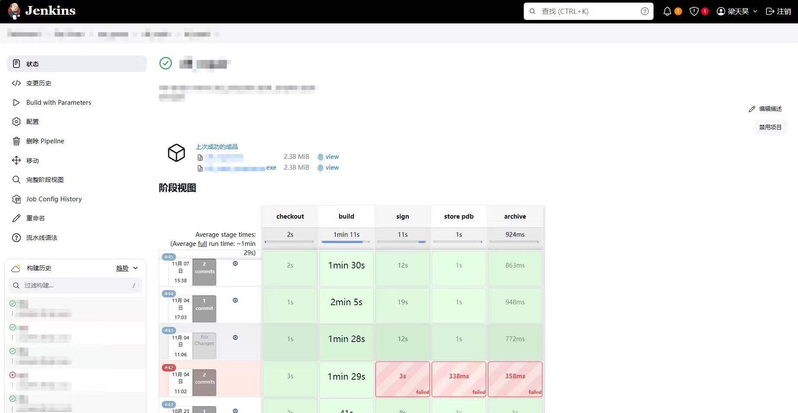
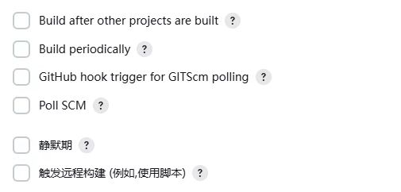
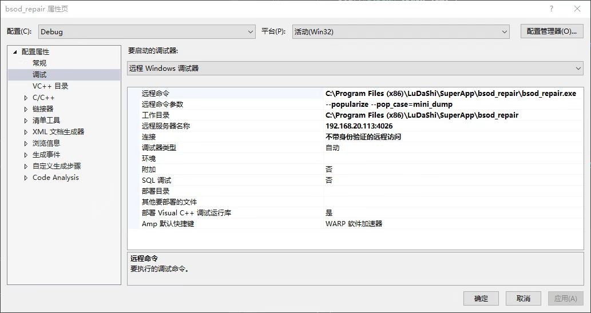
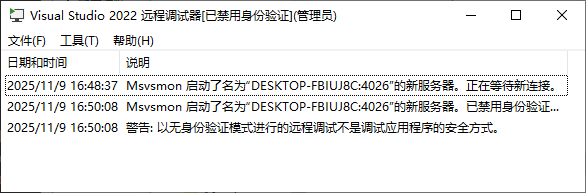

## 工作总结

- 从零开发蓝屏修复项目.
- 封装aliyun-oss-cpp-sdk接口到动态库中, 供后续dll修复的上传功能使用.


## Jenkins

这算是一个`CI/CD`工具, 貌似现在非常多公司都在用这个, 其功能在于**持续集成/持续交付 + 自动化**, 虽然这么说, 感觉很高端很厉害, 但是如果不实际接触, 感觉还是很难摸清其中的门道, 我下面就用比较简单的语言一边理解一边介绍吧.

### 初步理解

你可以认为这个工具可以在服务器上部署, 其可以做的事简单来说大抵可以包括 : 

- 拥有一个或很多个干净且没有外部污染的编译构建环境(当然是你自己搭建, 只是在这里单独搭建更安全也方便多人协作).
- 为编译构建项目提供很多便利, 比如配置构建参数, 编写构建前提和后续, 列出构建结果.
- 提供很多的自动化配置, 比如定时从git平台上拉取新的代码自动构建.
- **PipeLine** : Jenkins的核心 --- 流水线, 可以通过配置PipeLine脚本来实现开发流程的流水线化, 比如`拉取git代码 -> 编译构建 -> 配置签名 -> 存储调试符号 -> 将结果列举`, 当然还可以更复杂更多样, 比如开始时**拉取docker重装环境**, 保证环境洁净, 又或者后续执行**自动化测试**等等.
- 作为一个服务提供给外部网站申请资源(类比Redis), 开发人员可以直接从网站上一览项目构建情况, 并且实现资源互通.

不过我认为也不要过度神话此工具, 因为其最终实现的**是也只是自动化**, 我们需要想的是自动化的流程如何搭建, 怎么写PipeLine, 比如拉取git我们就要提供git平台, 编译构建需要我们自己搭建平台,  Jenkins最后在脚本中实际也只是执行一下bat罢了.

### Pipeline

这里先介绍核心流水线, 其本质就是**使用`Groovy`语言的脚本代码**, 目的是串通项目各个阶段的流程.

下面是一个模板 : 

```groovy
pipeline {
    agent any    
    parameters {
        extendedChoice(...)
        booleanParam(...)
    }
    environment {
        SLN_PATH = ...
    }
    stages {
        stage('checkout') {
           steps {
                checkout(...)
           }
        }
        stage('build') {
            steps {
                script {...}
            }
        }
        stage('sign') {
            steps {
                script {...}
            }
        }
        
        stage('store pdb') {
            steps {
                script {...}
            }
        }
        stage('archive') {
            steps {
                script {...}
            }
        }
    }
}
```

- 你可以认为Jenkins的PipeLine中又一些关键词可以触发设置好的操作, 下面介绍这些关键词.

- parameters : 使项目**参数化**, 让项目在手动开始流水线前可以选择一些参数或是配置, 比如构建哪些项目, 构建用的参数怎么设置.

- environment : 设置一些本次构建需要用的环境变量.

- stage : 一个stage代表流水线的一个阶段, 每个阶段就要干对应的事情.

- checkout :

  ```groovy
  stage('checkout') {
          steps {
              checkout([$class: 'GitSCM', 
                       branches: [[name: "${branchName}"]], // 分支名，可能由其他方式传入
                       userRemoteConfigs: [[url: '你的代码仓库']],
                       extensions: [[$class: 'RelativeTargetDirectory', relativeTargetDir: 'subfolder']] // 拉取到指定子目录
                      ])
          }
      }
  ```

  只要这里设置好了, 流水线进行到这里就会去你配置好的git仓库中取出对应的代码.

- script : 也许你会发现后面的阶段用的都是script, 这其实是在groovy语法中内置js语法, 可以去做一些更灵活的操作, 比如构建/删除目录, 设置项目输入输出, 执行目标操作等等. 下面只展示build处的部分配置 : 

  ```cpp
  stage('build') {
              steps {
                  script {
                      // 遍历所有选中的场景
                      def selectedScenes = ...            
                      selectedScenes.each { scene ->
                          // 动态设置输出目录
                          def outputDir = scene == 'popularize' ? 
                              "$WORKSPACE\\...\\out\\Release_popularize" : 
                              "$WORKSPACE\\...\\out\\Release"        
                          def config = scene == '..."
                          // 清理输出目录
                          bat "if exist ${outputDir} (rmdir /S /Q ${outputDir})"
                          // 构建主程序
                          if (params.build_main) {
                              bat "..."
                          }
                      }
                  }
              }
          }
  ```

- bat : 执行Shell命令, 这个操作非常灵活, 其实就是你在操作系统上可以干什么, bat就可以干什么.
- archiveArtifacts : 归档构建产物, 可以将一些构建成果(如exe, jar, html, bat, tpi等等)打包展示在主界面供项目成员下载.
- publishHTML : 发布一个html报告到构建页面, 可以直接在网站上阅览.
- `docker.image(...).inside` : 直接在流水线中动态启动一个Docker容器搭建构建环境, 就可以连搭环境都省去.

于是我们就可以又一个非常直观有用的Jenkins页面了!



### 构建触发器



在配置界面有这样的选项, 都属于触发器的范畴, 本质就是在满足一些情况后自动构建给项目.

- Build after other projects are built : 设置上游依赖, 一些项目会有练习, 比如B依赖于A, 那么B就可以在这里配置A, 那么A构建完, B也会自动构建.
- Build periodically : 定时构建.
- GitHub hook trigger for GITScm polling : 这个很好用, 可以在git托管平台上设置我们的Jenkins, 当发生push或merge时, 平台会自动通知Jenkins服务器, 于是就会自动进行构建.
- Poll SCM : 属于上一种的下位替代, 可以让Jenkins定期向git托管平台检查代码有无更新.


## VS远程调试

- 意义 : **测试不同机型, 操作系统下程序是否依旧保持稳定**. 
- 必要性 : 在其他OS上再安一边vs然后调实在有些弱智, 而vs远程调试可以有效降低不同OS上测试同一套程序的测试成本.
- 本质 : 就是把自己本地编出来的exe或dll放到其他OS上运行, 但是可以远程调试.
- 其他OS的来源可以是其他电脑, 用个ToDesk连过去, 也可以做虚拟机, 这点看实际情况.

### 远程调用方

- 把vs目录下的Remote Debugger文件夹压缩拷到目标OS上. 我的路径是这个:

  `C:\Program Files\Microsoft Visual Studio\2022\Community\Common7\IDE\Remote Debugger`

- Remote Debugger中有X86/X64, 看你的代码是32位还是64位的, 点进去找到`msvsmon.exe`, 以管理员身份运行, 点击工具->选项, 身份验证设置为无, 允许任何用户进行调试.

  

- 你的最终目的是再目标OS上执行你的exe文件, 因此必须要把exe和其依赖的所有文件压缩拷到目标OS上, 如果只是普通的vs项目, 构建成功后直接拷贝Debug目录就行, 其他的话要自己斟酌. (这里必须好好考量)

### 本地

- 将`本地Windows调试器`切换为`远程Windows调试器`.

- 打开要调试的项目的属性, 设置远程命令/远程命令参数(如果有的话)/工作目录/远程服务器名称/连接 : 

  

  - 远程命令 : 你要执行的exe的绝对路径.
  - 工作目录 : exe所在目录或是安装目录.
  - 远程服务器名称 : 这里要自己看目标OS的IP地址, 自己搜一下怎么看, 后面加上端口.
  - 连接 : 不带身份验证.

  至此开始调试即可, 操作和正常调试没有任何区别.


## 运行库

关于运行库, 你可以仅仅理解静态库和动态库的原理, 也许够用, 但是如果深入进去的话, 大有可以说道的地方, 在我的认知中, 这不算是什么实用知识, 但是算一种"技术底蕴"吧.

### CRT(C/C++ Runtime Library)

总所周知, 程序运行不只依靠自己的代码, 更依靠各种标准库.

你可以认为CRT就是**C/C++运行库**, 是环境, 是C标准库, 是C++标准库, 是Windows.h等等, 一定要把CRT和各种第三方动静态库区分开.

而CRT是可以**选择链接方式**的, 也就是说你可以使用静态库版本的CRT, 那就是**/MT**, 也可以使用动态库版本的CRT, 那就是**/MD**, 至于/MTd和/MDd是Debug版本的就不多说了.

我们可以在VS项目属性中设置**运行库**选项来**配置链接方式**, 不同的选择方式当然就对应了动静态库的优劣了.

### 动静态库对于CRT链接方式的正交选择

在我们的认知中, 动态库可能适合/MD, 静态库可能适合/MT,实际上也确实适合, 但是其实本身这种选择是**正交**的, 动静态库都可以选择/MD和/MT, 毕竟说到底这也只是在选择使用CRT的动静态罢了.

- 以`dll + /MT`为例, 这种dll就会把一套静态的CRT放到自己的代码内部, 而自己dll内部的代码就会优先使用这套CRT, 可以做到自给自足, 并且也防止了CRT版本差异导致的冲突. 也是就是说, 当你不想依赖外部环境, 想让依赖高度内部化时, 这种选择是可行的.

### EXE项目对于CRT链接方式的选择

这里有两种情况 : 

- 如果没有依赖其他第三方库, 有大家都有对应环境就用/MD, 想高度集成做绿色版就用/MT.
- 如果有, 那么还有两种情况 :
  - 如果依赖项中**存在静态库**, 那么**必须和静态库的链接方式相同**. 毕竟如果静态库是/MT, CRT代码本来就有一份, 你设置/MD, 还要去找一个共享的CRTdll, 就必定会发生重复定义, 编都编不过.
  - 如果依赖项中**只有动态库**, 也**最好和动态库的链接方式相同**.但是存在一个例外, 如果动态库是/MT, 只要双方各自只管理自己的内存, 也就是说, 动态库接口中输出的内容是**原始类型或POD**的话, exe怎么选都可以, 因此和上面想表达的一样, **设计好接口的/MT动态库**也是一种降低各种依赖风险, 实现高内聚的手段. 

### 由链接方式不同导致堆管理产生的崩溃冲突

这个议题看起来很复杂, 并且各种解释也非常多, 但是从最基础的底层分析我认为最好.

众所周知, C/C++最核心的部分是内存管理, 而且是**堆内存管理**, 栈和全局根本不需要我们管, 而堆内存的管理十分自由, 可以是**C风格手动申请手动释放**, 也可以是**C++风格的构造析构与RAII**.

但这一切的一切的**前提**, 你需要知道是用什么申请释放/构造析构的, 那就是**CRT里对应的代码**.

那么在这个前提下, 我们假设一个最可能的情景, **`exe(/MD) + dll(/MT)`** : 

- 我们假设要使用malloc, 那么会用到msvcr140.
- 我们还假设, **dll中的函数会使用malloc申请内存**, 然后把申请好内存的指针传出给exe, 然后**exe使用完后手动释放**. 这样看起来没什么问题, 有申请就有释放, 很合理, 但要结合我们上面的CRT来分析.
- dll选择的/MT, 那么其内部本身就有一套`msvcr140.lib`的代码, 其直接调用里面的malloc去堆上申请内存并记录各种申请情况.
- exe选择的/MD, 那么其会使用一个共享的`msvcr140.dll`, 这里就可以很明显发现问题了, 如果exe去用`msvcr140.dll`上的free释放dll内部`msvcr140.lib`申请的内存, `msvcr140.dll`就会发现**自己根本没申请过这块内存**, 你却让我free, 这般强人所难, 那就只好崩溃了.

至此我们应可以比较清楚地感知到由链接方式不同导致堆管理产生的崩溃冲突了.

那么我们也应该可以理解前面说的**设计好接口的/MT动态库**是什么意思了, 本质就是**不要导出内存管理相关的内容**, 只导出原始类型或POD.

### 胖动态库

这算是一种相对实用的动态库设计方式, 先不介绍, 先看一眼整体结构 : 

```bash
[xxxxxx.exe] (链接方式任意)
    |
    | 链接
    |
[你的动态库.dll] (/MT)
    |    
    | 链接 
    | 
[第三方库A.lib]
[第三方库B.lib] (/MT)
[第三方库C.lib]
```

这本质其实算是一种**静态库的聚合**, 但dll作为最后的一层**中间层**, 可以让最后呈现出的效果可以既有静态库的高内聚, 也有动态库的共享与接口导出等优势, 虽然你可以认为这样体积会很大(因此被称为胖动态库), 但这确实也是一种**折中**的方案.

反观其他情况 : 

- 假如你**都用静态库**, 最后体积会更大, 并且如果你这个库通用性比较强, 不能共享的劣势是很大的.
- 假如你**都用动态库**, 那么总所周知会有`DLL HELL`的老大难问题, 其本质是因为不同动态库要求的CRT版本可能不同, 由于兼容性或覆盖的关系会导致崩溃, 这里不再细讲, 但这里胖动态库只有最后一层使用dll, 可以很好的解决这个问题.

### C++动态库导出纯C接口

这算是前面崩溃问题的话题延续, 有了前面例子的铺垫, 这个习惯就很好理解了.

- 假设动态库为在导出的接口中使用了`std::string&`(这种情况很场景), 这里假设是参数.

  ```cpp
  void ModifyString(std::string& str);
  ```

那么这种情况存在**两层风险**: 

- 第一层是**C++标准库版本不同**, 如果exe使用`MSVC2022`, 而dll使用`MSVC2019`, exe用2022构造出了`std::string`传给dll, dll用2019解析, 由于C++标准库的实现**经常不向前兼容**, 直接崩溃是非常常见的.

- 第二层是**前面说的崩溃情况**, 就算是C++标准库版本相同, 假设dll是**/MT**的, 那么其自己会维护一套CRT代码, exe用别的CRT构造出了`std::string`传给dll, 分析之类的也许可以, 但是一旦dll向重新分配string的内存, 做出类似如下的操作 : 

  ```cpp
  str += "a very long string...";
  ```

  那么dll中的C++标准库就会发现其不是自己申请的, 就不可能会有, 故而崩溃.

至此我们可以发现**将C++标准库中内容作为导出接口的参数或返回值都是极其危险的**.

而解决方式就是**导出纯C接口, 并且只使用原始类型或POD**, 这样上面的两个问题就不复存在了.

下面是例子 : 

```cpp
// dll接口
// 纯C接口，不涉及任何C++对象
extern "C" __declspec(dllexport) const char* get_message();
extern "C" __declspec(dllexport) void free_message(const char* msg);
```

```cpp
// dll实现
// 内部仍可使用C++
extern "C" const char* get_message() {
    std::string* msg = new std::string("Hello World"); // 在DLL内分配
    return msg->c_str();
}
extern "C" void free_message(const char* msg) {
    // 在DLL内释放，确保分配和释放在同一侧
    // 需要一些技巧来获取并删除对应的std::string对象
    // 例如：delete reinterpret_cast<std::string*>(const_cast<char*>(msg - offset));
}
```

```cpp
// exe调用
// 即使是C++程序，也只处理C风格字符串
const char* message = get_message();
std::cout << message << std::endl;
free_message(message); // 调用DLL提供的释放函数
```

这里有一个非常有趣的事情是, 我上个月看一个佬直播用C++写MAA的框架库, 当时他就正在给自己的动态库导出纯C接口, 然后我看评论区有人在嘲讽用纯C接口干什么, 直接用C++就行了, 我当时细想也没想通为什么非要写纯C接口, 结果现在茅塞顿开之后, 只觉得很酷, 也许这就是我一开头说的"技术底蕴"吧.

## 细碎知识总结

- `utf8 with BOM` 这个貌似是微软utf-8的带编码签名的格式, 专门用在Windows上的. 

- 使用SDK8.1时一定要把 C++ -> 语言 -> 符合模式, 符合模式判为no.

- 动态库导出最好用.def文件导出, 更清晰一些.

- 合格的项目需要有良好的版本号规范, vs项目中可以通过 项目 -> 添加 -> 资源 -> Version, 据此构建出VS_VERSION_INFO, 在其中可以设置version/copyright/description/companyname等等, 你点击exe的属性->详细信息显示的就是这些.

- git中的`rebase`指令可以合并以往多次的commit, 适合于多次commit但并没有push, 最后push时将前面的所有commit合并的情况.

  ```bash
  git log --oneline --graph
  ```

  通过该指令可以查看提交情况.

  ```bash
  git rebase -i HEAD~4 # 合并最近4个提交
  ```

  然后会让你编辑 : 

  ```bash
  pick 1m2n3o4 实现核心功能
  squash 7i8j9k0 临时提交，还需要修改
  squash e4f5g6h 再次完善功能
  squash a1b2c3d 修复一个小bug
  ```

  这里squash表示要压缩的commit, 最后要留下最后一个commit.

- `hosts` : 

  这类似于一个域名解析的文本文件, 优先级高于DNS. 一般存在于C:\Windows\System32\drivers\etc下. 

  文本类似下面:

  ```cpp
  # Copyright (c) 1993-2009 Microsoft Corp.
  #
  # This is a sample HOSTS file used by Microsoft TCP/IP for Windows.
  #
  # This file contains the mappings of IP addresses to host names. Each
  # entry should be kept on an individual line. The IP address should
  # be placed in the first column followed by the corresponding host name.
  # The IP address and the host name should be separated by at least one
  # space.
  #
  # Additionally, comments (such as these) may be inserted on individual
  # lines or following the machine name denoted by a '#' symbol.
  #
  # For example:
  #
  #      102.54.94.97     rhino.acme.com          # source server
  #       38.25.63.10     x.acme.com              # x client host
  
  # localhost name resolution is handled within DNS itself.
  #	127.0.0.1       localhost
  #	::1             localhost
  
  xxx.xxx.xxx.xxx(B) xxx.com(A)
  ```

  **hosts文件是电脑访问网络时的"第一道关卡",可以通过它来告诉电脑:"当你要访问A这个网址时，别问DNS了,直接去B这个IP地址."**因此在使用未注册DNS的服务器时要用这个文件, 一般用于配置企业内网.
  
- Assoc(文件关联) : 这个其实就是在针对扩展名和打开软件进行设置, 经常出现的**选择打开方式**就是在设置这个.

## 项目细节分析

### GetModuleLV

可以直接获取模块相对于安装目录的层数, 需要在一开始根据你exe/dll在安装目录中实际位置进行设置.

在大体量多文件软件中这种设计很有优势, 可以更方便地找到根目录, 然后再据此拼接需要的路径.

### Roaming

虽然软件一般都会安装在`C:\Program Files\` 或`C:\Program Files (x86)\`下, 但是用户数据一般都会存放在`C:\Users\AppData\Roaming`或`C:\Users\AppData\Local[应用名]`下.

一般认为`Roaming`下存储用户配置等用户数据, `Local`下存储日志文件等本地数据.

### Tpi细节

- `Popularize` :
  **具体弹窗类**, 整个类控制一种弹窗的整个状态周期, 包括初始化, 弹窗准备, 弹窗运行, 关闭处理(弹窗管理), 默认弹窗类型准备.

- `PopularizeConfig` : 
  可以理解为是**云端配置拉取**, 就是把一些经常可能发生变动的配置(比如白名单, 下载路径, 时间设置)存在云端, 当云端配置发生更新时, 本地运行的配置中心会调用`OnSlowConfigUpdate`, 这里会把配置读出来然后执行配置更新回调.

  - 该类构造需要传入配置更新时的回调函数, 并且需要自己编写, ParseConfig针对项目专门的配置进行读取.
  - 使用该类需要调用Init函数, 其中会拉起配置中心的dll, 当然也需要对应的UnInit.

- `PopularizeHelper`:

  上面两个还偏模板一些, 但这个主要就是看实际情况编写了, 可以理解为`Popularize`和`PopularizeConfig`的具体管理类, 包括云配置服务的初始化和弹窗示例的初始化以及管理.

### 杂项

- `DECLARE_WND_CLASS` : ATL再构造函数中设置全局唯一的窗口名.
- `MESSAGE_HANDLER` : 关注某个消息, 并且需要传入回调.


