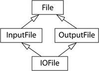
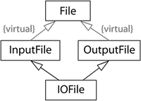

## 条款40 : 明智而审慎地使用多重继承

>相比于java选择单继承+接口类多继承的方式, C++选择了更加直接的方式, 其允许多重继承存在. 不可否认的是确实大多数情况下单继承都可以胜任, 但是同样不可否认的是多重继承也一定有其用武之地. 在本条款中, 我们将认识多重继承, 了解辅助其实现的虚继承机制, 并且知晓多重继承的主要应用场景.

多重继承的意思是**继承一个以上的基类**, 一般来说**我们不希望这些基类在继承体系中又有更高级的继承**, 这样会带来菱形继承的问题, 并且为了解决这种问题, 我们还要祭出虚继承这一机制来克服, 接下来我们将会逐一简单介绍菱形继承和虚继承机制.

----

### 菱形继承

简而言之就是派生类继承的多个基类中, 含有共同的父类. 如下图所示 : 



如此这般, 假设`IOFile`中有成员, 那么`InputFile`和`OutputFile`中也会继承相应的成员, 那么File就继承到了两份相同的成员. 那么如何处理这种情况就是C++要解决的问题, 如何解决有两派观点 : 

- File中就是有两份成员, 这是最直观的逻辑, 所以调用时都必须指定明确的基类.

  ```cpp
  File f;
  cout << f.InputFile.a << endl;  // 假设IOFile中有成员变量a
  cout << f.OutputFile.a << endl;
  cout << f.a << endl; // 编译错误!
  ```

- `IOFile`只有一个文件名称, 所以继承自`IOFile`的成员不应当重复.

**C++默认使用第一种方案, 毕竟这是最直观的逻辑, 但同时也提供了虚继承机制以支持第二种方案.**

---

### 虚继承

简而言之就是对存在菱形继承的基类们在继承时前加virtual, 那么以后就不会出现继承两份的情况了, C++在底层会解决所有问题.

图示如下 : 



代码如下 : 

```cpp
class File { ... };
class InputFile: virtual public File { ... };
class OutputFile: virtual public File { ... };
class IOFile: public InputFile,
              public OutputFile
{ ... };
```

具体实现细节我们不再详述, 但是我们有必要再次明确虚继承的劣势 : 

- 使用虚继承产生的对象会**体积更大, 访问速度更慢**.
- 派生类必须为从虚继承而来的基类中的成员变量进行**手动初始化**.

这对我们的代码编写和实际运行都有一定影响.

对于虚继承, 我们建议要**尽量避免使用**, 如果有必要也**不要在虚基类中添置成员变量等数据**.

---

### 多重继承的使用情景

上面的两个知识都运用在特殊情况下, 然而我们平时不会想也不建议出现菱形继承的情况. 熟练使用多重继承可以在一些情景下达到事半功倍的效果, 有一种情况最为常见, 如果我们**希望某个类public继承自某个接口类, 并且private继承某个协助其实现的class**, 我们接下来也会举出一个这样的例子 : 

假设我们有一个塑模人的接口类 : 

```cpp
class IPerson {
public:
  virtual ~IPerson();

  virtual std::string name() const = 0;
  virtual std::string birthDate() const = 0;
};
```

这是一个对人塑模的抽象基类, 我们希望使用工厂函数创造出一些可以被当作`IPerson`来使用的对象, 这些对象的静态类型是`IPerson`, 动态类型是`IPerson的派生类`, 工厂函数通过各种需求和条件生成对应的对象, 另外附加一点, 这个工厂函数要生成一个Person需要一个存储在数据库中的唯一id, 需要从用户处获取, 然后便可通过id获取Person的基本信息 : 

```cpp
std::shared_ptr<IPerson> makePerson(DatabaseID personIdentifier);  // 工厂函数, 需要一个数据库id

DatabaseID askUserForDatabaseID();  // 向用户获取id的功能函数

DatabaseID id(askUserForDatabaseID());  // 用获取到的id创建DatabaseID对象
std::shared_ptr<IPerson> pp(makePerson(id));  // 将该对象传入工厂函数生成需求对象
```

有了这些前戏, 我们就需要提供`IPerson`的派生类了, 我们假设这个class名为`CPerson`, 其必须继承自`IPerson`, 当然我们自然可以从无到有从写所有`IPerson`传来的接口函数, 但是假如我们有现成的一个可以帮助我们实现的类, 继承它可能是最好的选择 : 

```cpp 
class PersonInfo {			// 这个类被用来协助以各种格式打印从数据库中调出的数据
public:
  explicit PersonInfo(DatabaseID pid);
  virtual ~PersonInfo();
  virtual const char * theName() const;
  virtual const char * theBirthDate() const;
  ...
private:
  virtual const char * valueDelimOpen() const;      // 传出字符串的前缀
  virtual const char * valueDelimClose() const;     // 传出字符串的后缀
  ...
};

const char * PersonInfo::valueDelimOpen() const
{
  return "[";                       // 默认前缀, 可重写
}

const char * PersonInfo::valueDelimClose() const
{
  return "]";                       // 默认后缀, 可重写
}

const char * PersonInfo::theName() const   // 这个函数将会通过传入的数据库id调出且生成加工后的name
{
  static char value[Max_Formatted_Field_Value_Length];  // 缓存区
  std::strcpy(value, valueDelimOpen());  // 写入前缀

  // 中间可能会很长, 会实现利用id从数据库中调用name的操作
 
  std::strcat(value, valueDelimClose());  // 写入后缀

  return value;
}
```

于是我们便可写出一个public继承自`IPerson`, private继承自`PersonInfo`的`CPerson`派生类, 他**通过PersonInfo提供的功能实现了IPerson继承来的接口**, 这种多重继承确实是**最合理最高效最简洁**的做法 : 

```cpp
class CPerson: public IPerson, private PersonInfo {     // 采用多重继承
public:
  explicit CPerson(    DatabaseID pid): PersonInfo(pid) {}
  virtual std::string name() const                      
  { return PersonInfo::theName(); }                     // 直接取用PersonInfo的功能调出name字符串
                                                        
  virtual std::string birthDate() const                 
  { return PersonInfo::theBirthDate(); }				// 同理
}; 
```

当前name()传出的字符串是`[name]`这种风格, 当然你也可以根据需求改变信息的格式, 我们可以通过重写`PersonInfo`虚函数的方式改变格式 :

```cpp
class CPerson: public IPerson, private PersonInfo {   
    ...
private:                                                
  const char * valueDelimOpen() const { return "<"; }    // 这里重写虚函数
  const char * valueDelimClose() const { return ">"; }   // 传出的格式改为 : <name>
}; 
```

---

### 尾声

请把多重继承当作成一个工具, 它可以将不同的类以不同的方式结合到一起, public继承意味着"is-a", private继承意味着"is-implemented-in-terms-of", 当然如果你有一个单继承的设计方案可以达到相同的效果, 那么还是应当选用单继承. 多继承只是在一些情况下是最合理最高效最简洁的做法.

---

### 请记住 : 

- 多继承会比单继承复杂, 并且有可能会导致菱形继承, 引发对虚继承的需求.
- 虚继承会增加大小, 速度, 初始化等成本, 如果虚继承建议虚基类不要带任何数据.
- 多继承确实有其用武之地, 一种常见情况是"某个类public继承自某个接口类, 并且private继承某个协助其实现的class".


by 天目中云