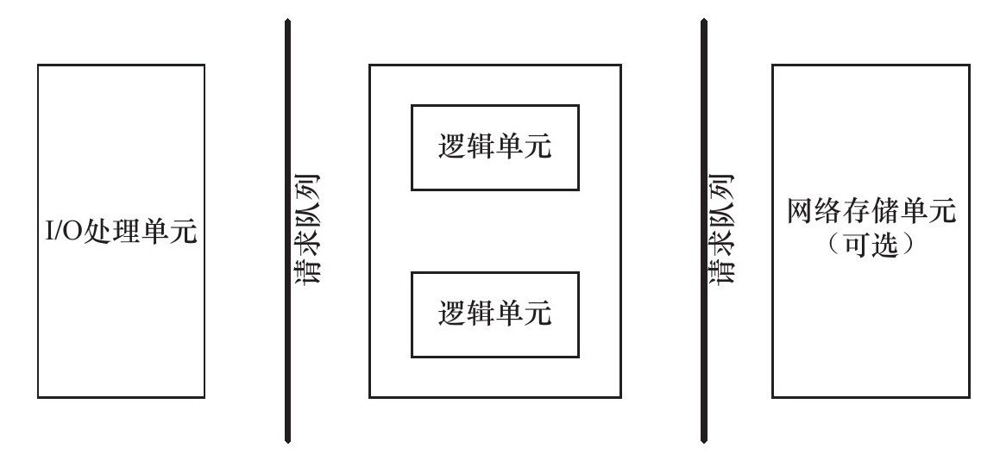
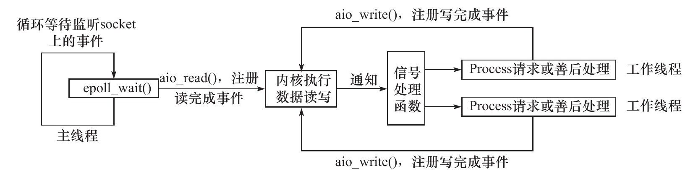

> **第八章 高性能服务器程序框架**

本章意在抛出一些核心的概念, 实操基本没有, 但是这些概念的理解我认为相对重要, 我会以口语化的形式简要描述.

## 服务器模型

- C/S模型 : 客户端/服务端, 最基础的服务器模型, 资源集中在服务端, 主要是客户端向服务端申请资源.
- p2p模型 : 每个主机都可以是客户端和服务端, 每个主机上都会存有一定的资源, 每个主机利用洪泛向每个点申请资源.

---

## 服务器编程框架



- I/O处理单元 : 用于处理客户连接, 实现负载均衡, 可以用主线程实现, 也可以直接用Nginx.
- 逻辑单元 : 一般是一个进程或线程, 一般用于处理核心逻辑, 也可进行数据的收发(依事件处理模式而定).
- 网络存储单元 : 就是数据库, 比如mysql.
- 请求队列 : 就是以上三者之间通信方式的抽象, 一般用池实现, 里面存放已经建立好的TCP连接.

---

## I/O模型

其实就在确定数据在收发时是阻塞还是非阻塞, 是同步还是异步.

- 阻塞和非阻塞属于**数据准备**阶段, 是系统IO操作的**就绪状态**.
- 同步和异步属于**数据读写**阶段, 是**应用程序和内核的交互方式**.

- 阻塞 : 在IO操作就绪时, 进程将被阻塞, 等待IO数据收发.

- 非阻塞 : 在IO操作就绪时, 会立即做出判断, 给出返回值, 退出函数, 通过返回值判断收发是否正常.

- 同步I/O : 读写操作在IO事件发生之后, 由应用程序本身完成.

  阻塞IO / IO复用 / SIGIO信号 都属于同步IO

- 异步I/O : 读写操作由内核完成, 应用程序只是提前设置缓冲区位置和IO操作完成后的通知函数.

---

## 两种高效的事件处理模式

服务器程序通常需要处理三类事件：I/O事件、信号及定时事件。

### Reactor模式

这是一种同步IO模式, 其中线程分为主线程和工作线程, 主线程负责监视socket是否有信息发送过来, 工作线程负责读写以及核心逻辑.

简略步骤如下 : 

- 主线程通过epoll注册socket的读就绪事件. 
- 主线程调用epoll_wait等待注册的socket发来消息.
- 某个socket可读时, 将其分发给工作线程.
- 工作线程进行读取并处理核心逻辑, 如果需要回复, 就用ekpoll注册写就绪事件.
- 主线程也会调用epoll_wait等待写事件.
- 当socket可写时, 主线程再将其分发给一个工作进程进行写操作.


### Proactor模式

一种异步IO模式, 基础思想与Reactor模式一直, 但是利用异步IO的机制减去了工作线程的读写工作, 读写工作由内核实现, 只需要设置通知函数唤醒工作线程.



---

## 有限状态机

这个名字真的很高端, 但实际有更简单的理解.

这是一个逻辑单元内部的高效编程手法, 可以简单理解为把一个事务分解成多个执行的阶段, 用enum把这些状态列举出来, 再用switch通过判断当前事务状态来分别调用对应的处理函数. 

比如我们要对HTTP请求进行读取和分析, http报文有请求行/请求报头/请求正文三个部分, 由于TCP传输一次传输可能不完整, 我们可能读不完全, 我们可以把状态分为请求行读取, 报头读取, 正文读取, 在不同的状态执行不同的读写操作和处理操作. 并且我们也应当设置合理的状态转移, 比如当前状态为请求行读取, 在相关操作处理完后, 那么状态就应当被转化为报头读取.

下面是完整的代码, 确实非常冗长, 上面这一段算是我最精简的概括了, 其实经过求证其实也没有多大必要去详细记住, 因为现在有很多的http库可以解决这方面的问题, 我们主要是重在理解这个概念.

```cpp
#include <sys/socket.h>
#include <netinet/in.h>
#include <arpa/inet.h>
#include <assert.h>
#include <stdio.h>
#include <stdlib.h>
#include <unistd.h>
#include <errno.h>
#include <string.h>
#include <fcntl.h>

#define BUFFER_SIZE 4096 /* 读缓冲区大小 */

/* 主状态机的两种可能状态，分别表示：当前正在分析请求行，当前正在分析头部字段 */
enum CHECK_STATE {
    CHECK_STATE_REQUESTLINE = 0,
    CHECK_STATE_HEADER
};

/* 从状态机的三种可能状态，即行的读取状态，分别表示：读取到一个完整的行、行出错和行数据尚且不完整 */
enum LINE_STATUS {
    LINE_OK = 0,
    LINE_BAD,
    LINE_OPEN
};

/* 服务器处理HTTP请求的结果：NO_REQUEST表示请求不完整，需要继续读取客户数据；GET_REQUEST表示获得了一个完整的客户请求；BAD_REQUEST表示客户请求有语法错误；FORBIDDEN_REQUEST表示客户对资源没有足够的访问权限；INTERNAL_ERROR表示服务器内部错误；CLOSED_CONNECTION表示客户端已经关闭连接了 */
enum HTTP_CODE {
    NO_REQUEST,
    GET_REQUEST,
    BAD_REQUEST,
    FORBIDDEN_REQUEST,
    INTERNAL_ERROR,
    CLOSED_CONNECTION
};

/* 为了简化问题，我们没有给客户端发送一个完整的HTTP应答报文，而只是根据服务器的处理结果发送如下成功或失败信息 */
static const char *szret[] = {"I get a correct result\n", "Something wrong\n"};

/* 从状态机，用于解析出一行内容 */
LINE_STATUS parse_line(char *buffer, int &checked_index, int &read_index) {
    char temp;
    /* checked_index指向buffer（应用程序的读缓冲区）中当前正在分析的字节，read_index指向buffer中客户数据的尾部的下一字节。buffer中第0～checked_index字节都已分析完毕，第checked_index～(read_index-1)字节由下面的循环挨个分析 */
    for (; checked_index < read_index; ++checked_index) {
        /* 获得当前要分析的字节 */
        temp = buffer[checked_index];
        /* 如果当前的字节是“\r”，即回车符，则说明可能读取到一个完整的行 */
        if (temp == '\r') {
            /* 如果“\r”字符碰巧是目前buffer中的最后一个已经被读入的客户数据，那么这次分析没有读取到一个完整的行，返回LINE_OPEN以表示还需要继续读取客户数据才能进一步分析 */
            if ((checked_index + 1) == read_index) {
                return LINE_OPEN;
            }
            /* 如果下一个字符是“\n”，则说明我们成功读取到一个完整的行 */
            else if (buffer[checked_index + 1] == '\n') {
                buffer[checked_index++] = '\0';
                buffer[checked_index++] = '\0';
                return LINE_OK;
            }
            /* 否则的话，说明客户发送的HTTP请求存在语法问题 */
            return LINE_BAD;
        }
        /* 如果当前的字节是“\n”，即换行符，则也说明可能读取到一个完整的行 */
        else if (temp == '\n') {
            if ((checked_index > 1) && buffer[checked_index - 1] == '\r') {
                buffer[checked_index - 1] = '\0';
                buffer[checked_index++] = '\0';
                return LINE_OK;
            }
            return LINE_BAD;
        }
    }
    /* 如果所有内容都分析完毕也没遇到“\r”字符，则返回LINE_OPEN，表示还需要继续读取客户数据才能进一步分析 */
    return LINE_OPEN;
}

/* 分析请求行 */
HTTP_CODE parse_requestline(char *temp, CHECK_STATE &checkstate) {
    char *url = strpbrk(temp, "\t");
    /* 如果请求行中没有空白字符或“\t”字符，则HTTP请求必有问题 */
    if (!url) {
        return BAD_REQUEST;
    }
    *url++ = '\0';
    char *method = temp;
    if (strcasecmp(method, "GET") == 0) { /* 仅支持GET方法 */
        printf("The request method is GET\n");
    } else {
        return BAD_REQUEST;
    }

    url += strspn(url, "\t");
    char *version = strpbrk(url, "\t");
    if (!version) {
        return BAD_REQUEST;
    }
    *version++ = '\0';
    version += strspn(version, "\t");

    /* 仅支持HTTP/1.1 */
    if (strcasecmp(version, "HTTP/1.1") != 0) {
        return BAD_REQUEST;
    }

    /* 检查URL是否合法 */
    if (strncasecmp(url, "http://", 7) == 0) {
        url += 7;
        url = strchr(url, '/');
    }
    if (!url || url[0] != '/') {
        return BAD_REQUEST;
    }
    printf("The request URL is:%s\n", url);

    /* HTTP请求行处理完毕，状态转移到头部字段的分析 */
    checkstate = CHECK_STATE_HEADER;
    return NO_REQUEST;
}

/* 分析头部字段 */
HTTP_CODE parse_headers(char *temp) {
    /* 遇到一个空行，说明我们得到了一个正确的HTTP请求 */
    if (temp[0] == '\0') {
        return GET_REQUEST;
    } else if (strncasecmp(temp, "Host:", 5) == 0) { /* 处理“HOST”头部字段 */
        temp += 5;
        temp += strspn(temp, "\t");
        printf("the request host is:%s\n", temp);
    } else { /* 其他头部字段都不处理 */
        printf("I can not handle this header\n");
    }
    return NO_REQUEST;
}

/* 分析HTTP请求的入口函数 */
HTTP_CODE parse_content(char *buffer, int &checked_index, CHECK_STATE &checkstate, int &read_index, int &start_line) {
    LINE_STATUS linestatus = LINE_OK; /* 记录当前行的读取状态 */
    HTTP_CODE retcode = NO_REQUEST; /* 记录HTTP请求的处理结果 */

    /* 主状态机，用于从buffer中取出所有完整的行 */
    while ((linestatus = parse_line(buffer, checked_index, read_index)) == LINE_OK) {
        char *temp = buffer + start_line; /* start_line是行在buffer中的起始位置 */
        start_line = checked_index; /* 记录下一行的起始位置 */

        /* checkstate记录主状态机当前的状态 */
        switch (checkstate) {
            case CHECK_STATE_REQUESTLINE: { /* 第一个状态，分析请求行 */
                retcode = parse_requestline(temp, checkstate);
                if (retcode == BAD_REQUEST) {
                    return BAD_REQUEST;
                }
                break;
            }
            case CHECK_STATE_HEADER: { /* 第二个状态，分析头部字段 */
                retcode = parse_headers(temp);
                if (retcode == BAD_REQUEST) {
                    return BAD_REQUEST;
                } else if (retcode == GET_REQUEST) {
                    return GET_REQUEST;
                }
                break;
            }
            default: {
                return INTERNAL_ERROR;
            }
        }
    }

    /* 若没有读取到一个完整的行，则表示还需要继续读取客户数据才能进一步分析 */
    if (linestatus == LINE_OPEN) {
        return NO_REQUEST;
    } else {
        return BAD_REQUEST;
    }
}

int main(int argc, char *argv[]) {
    if (argc <= 2) {
        printf("usage:%s ip_address port_number\n", basename(argv[0]));
        return 1;
    }

    const char *ip = argv[1];
    int port = atoi(argv[2]);
    struct sockaddr_in address;
    bzero(&address, sizeof(address));
    address.sin_family = AF_INET;
    inet_pton(AF_INET, ip, &address.sin_addr);
    address.sin_port = htons(port);

    int listenfd = socket(PF_INET, SOCK_STREAM, 0);
    assert(listenfd >= 0);

    int ret = bind(listenfd, (struct sockaddr *)&address, sizeof(address));
    assert(ret != -1);

    ret = listen(listenfd, 5);
    assert(ret != -1);

    struct sockaddr_in client_address;
    socklen_t client_addrlength = sizeof(client_address);
    int fd = accept(listenfd, (struct sockaddr *)&client_address, &client_addrlength);
    if (fd < 0) {
        printf("errno is:%d\n", errno);
    } else {
        char buffer[BUFFER_SIZE]; /* 读缓冲区 */
        memset(buffer, '\0', BUFFER_SIZE);
        int data_read = 0;
        int read_index = 0; /* 当前已经读取了多少字节的客户数据 */
        int checked_index = 0; /* 当前已经分析完了多少字节的客户数据 */
        int start_line = 0; /* 行在buffer中的起始位置 */

        /* 设置主状态机的初始状态 */
        CHECK_STATE checkstate = CHECK_STATE_REQUESTLINE;

        while (1) { /* 循环读取客户数据并分析之 */
            data_read = recv(fd, buffer + read_index, BUFFER_SIZE - read_index, 0);
            if (data_read == -1) {
                printf("reading failed\n");
                break;
            } else if (data_read == 0) {
                printf("remote client has closed the connection\n");
                break;
            }

            read_index += data_read;

            /* 分析目前已经获得的所有客户数据 */
            HTTP_CODE result = parse_content(buffer, checked_index, checkstate, read_index, start_line);
            if (result == NO_REQUEST) { /* 尚未得到一个完整的请求 */
                continue;
            } else if (result == GET_REQUEST) { /* 得到一个完整的、正确的HTTP请求 */
                send(fd, szret[0], strlen(szret[0]), 0);
                break;
            } else { /* 其他情况表示发生错误 */
                send(fd, szret[1], strlen(szret[1]), 0);
                break;
            }
        }
        close(fd);
    }
    close(listenfd);
    return 0;
}
```

书中说这里有两个状态机, 分为主状态机和从状态机, 从状态机用于解析出一行的内容, 主状态机用于根据当前状态选择不同的处理函数.

----

## 提高服务器性能的其他建议

### 池

以空间换时间, 即“浪费”服务器的硬件资源, 以换取其运行效率, 这就是池（pool）的概念。

池是一组资源的集合，这组资源在服务器启动之初就被完全创建好并初始化，这称为静态资源分配。当服务器进入正式运行阶段，即开始处理客户请求的时候，如果它需要相关的资源，就可以直接从池中获取，无须动态分配。很显然，直接从池中取得所需资源比动态分配资源的速度要快得多，因为分配系统资源的系统调用都是很耗时的。当服务器处理完一个客户连接后，可以把相关的资源放回池中，无须执行系统调用来释放资源。从最终的效果来看，池相当于服务器管理系统资源的应用层设施，它避免了服务器对内核的频繁访问。

根据不同的资源类型，池可分为多种，常见的有内存池、进程池、线程池和连接池。

- 内存池通常用于socket的接收缓存和发送缓存。对于某些长度有限的客户请求，比如HTTP请求，预先分配一个大小足够（比如5000字节）的接收缓存区是很合理的。当客户请求的长度超过接收缓冲区的大小时，我们可以选择丢弃请求或者动态扩大接收缓冲区。

- 进程池和线程池都是并发编程常用的“伎俩”。当我们需要一个工作进程或工作线程来处理新到来的客户请求时，我们可以直接从进程池或线程池中取得一个执行实体，而无须动态地调用fork或pthread_create等函数来创建进程和线程。

- 连接池通常用于服务器或服务器机群的内部永久连接。每个逻辑单元可能都需要频繁地访问本地的某个数据库。简单的做法是：逻辑单元每次需要访问数据库的时候，就向数据库程序发起连接，而访问完毕后释放连接。很显然，这种做法的效率太低。一种解决方案是使用连接池。连接池是服务器预先和数据库程序建立的一组连接的集合。当某个逻辑单元需要访问数据库时，它可以直接从连接池中取得一个连接的实体并使用之。待完成数据库的访问之后，逻辑单元再将该连接返还给连接池。

### 数据复制

应当避免不必要的数据复制, 这就在要求我们善用内核处理函数, 例如sendfile, splice, tee等, 这些函数都是在内核空间中直接进行, 避免了向用户空间的拷贝. 当然共享内存也是一个很有用的手段.

### 上下文切换和锁

我们知道进程切换和线程切换也是会导致系统开销的, 使工作线程的数量保持在一个合理的范围内也是一个必要的行为. 

另外还有锁, 锁会带来大量的系统开销, 所以要善用读写锁等锁机制.