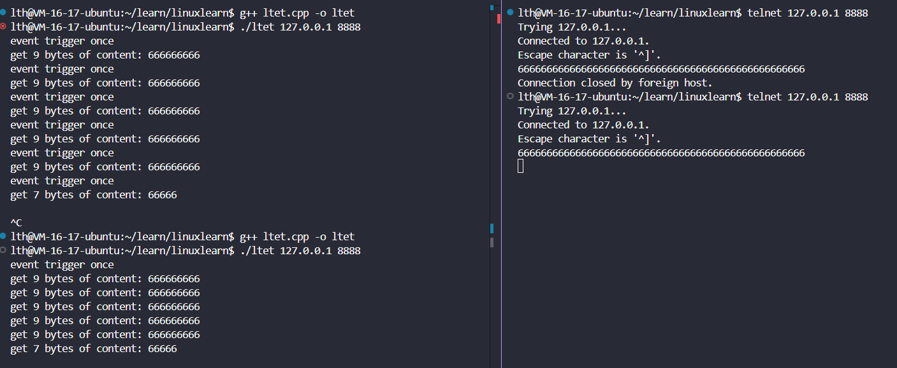

> 第九章 I/O复用(1)

本节主要描述三个IO复用函数, select / poll / epoll.

这里对select / poll只做简要描述, 对epoll做详尽描述.

所谓I/O复用, 就是使程序可通过一些函数**同时监听多个文件描述符**(如socket), 可以即使并发对这些文件描述符上的事件进行处理.

要注意的一点是I/O复用函数本身是**阻塞**的, 它属于同步IO的范畴, 其被广泛使用是因为其同时监听的特性可以大幅提升处理效率.

### select 

```cpp

#include＜sys/select.h＞
int select(int nfds,fd_set*readfds, fd_set*writefds, fd_set*exceptfds, struct timeval*timeout);
```

- nfds : 指定被监听的文件总数.
- fd_set : 一个整型数组, 其实就是用来存储文件描述符的
  - readfds / writefds / exceptfds 分别对应可读可写异常事件对应的文件描述符集合.

- timeout : 用来告诉程序select阻塞等待了多久, 是输出型参数.

---

### 文件描述符就绪条件

我们需要认识哪些情况下文件描述符可以被认为是可读、可写或者出现异常.

下列情况下socket可读：

❑socket内核接收缓存区中的字节数大于或等于其低水位标记SO_RCVLOWAT。此时我们可以无阻塞地读该socket，并且读操作返回的字节数大于0。

❑socket通信的对方关闭连接。此时对该socket的读操作将返回0。

❑监听socket上有新的连接请求。

❑socket上有未处理的错误。此时我们可以使用getsockopt来读取和清除该错误。

下列情况下socket可写：

❑socket内核发送缓存区中的可用字节数大于或等于其低水位标记SO_SNDLOWAT。此时我们可以无阻塞地写该socket，并且写操作返回的字节数大于0。

❑socket的写操作被关闭。对写操作被关闭的socket执行写操作将触发一个SIGPIPE信号。

❑socket使用非阻塞connect连接成功或者失败（超时）之后。

❑socket上有未处理的错误。此时我们可以使用getsockopt来读取和清除该错误。

---

### poll

```cpp
#include＜poll.h＞
int poll(struct pollfd*fds, nfds_t nfds,int timeout);
```

- nfds其实就是一个整数, 用来记录fds的大小.

- timeout记录了poll的阻塞超时值, 设置为-1则始终处于阻塞, 0则立即返回.

- fds需要细讲, 它是一个pollfd类型的数组, pollfd的结构如下 : 

  ```cpp
  struct pollfd
  {
  	int fd;/*文件描述符*/
  	short events;/*注册的事件*/
  	short revents;/*实际发生的事件，由内核填充*/
  };
  ```

  - fd : 就是要监视的文件描述符.
  - events : 这里由用户填入关心的事件.
  - revents : 这里会返回实际发生的事件, 由内核填充. 这里返回的事件只会和用户关心的事件有关. <输出型参数>

  在poll中事件用enum列举了出来 : 

  - POLLIN : 数据可读.
  - POLLOUT : 数据可写.
  - POLKLERR : 错误.
  - POLLHUP : 文件描述符被挂起.
  - POLLNVAL : 文件描述符没有被打开.
  - ......

​	和select相比, 可以理解为select只关心读写异常这三个事件, 而poll可通过在fds数组中设置实现对事件的关心和监视.

#### poll使用方式

我们首先要明确的就是这I/O复用函数监视的是事件, 不是fd, **是fd上发生的事件**, 这个事件一般是就绪读和就绪写事件.

我们使用poll首先要设置fds数组 : 

```cpp
// 初始化 pollfd 数组
struct pollfd fds[MAX_CLIENTS + 1]; // +1 用于服务器 socket
int nfds = 1; // 当前监视的文件描述符数量

// 将服务器 socket 添加到 pollfd 数组中
fds[0].fd = server_fd;
fds[0].events = POLLIN; // 监视可读事件

// 初始化客户端文件描述符
for (int i = 1; i <= MAX_CLIENTS; i++) {
    fds[i].fd = -1; // -1 表示未使用
}
```

然后将其传入poll函数, 程序运行到这里就会阻塞监听设置fd上的事件了 : 

```cpp
int ret = poll(fds, nfds, -1); // -1 表示无限等待
```

监听的事件发生后就会返回, 然后我们就需要遍历fds, 查看里面的revents, 如果什么都没有发生为0.

```cpp
// 检查所有文件描述符
for (int i = 0; i < nfds; i++) {
    if (fds[i].revents == 0) {
        continue; // 没有事件发生
    }
    // 不为0说明事件发生, 下面可以开始处理事件逻辑
}
```

---

### epoll系列函数

没错, epoll不是一个函数, 而是一系列函数, 包括epoll_create / epoll_ctl / epoll_wait函数等.

你可以理解为其是poll函数的升级版, 它把类似设置fds的行为利用函数在内核中实现, 并且还增加了很多提升效率的功能, 可以说是前两个函数的上位替代, 唯一不足的就是这个函数是Linux专属, 存在跨平台的问题.

#### 内核事件表

```cpp
#include＜sys/epoll.h＞
int epoll_create(int size);
```

- size用于提示事件表具体有多大, 无需准确, 这只是一个提示.

重要的是这个函数的返回值, 调用该函数会在内核创建一个事件表, 就类似于poll需要自己创建的fds, 函数返回值是**这个事件表的文件描述符**, 一般被叫做epid, 这个返回值会被用作下一个函数**epoll_ctl的第一个参数**.

#### epoll_ctl

```cpp
#include＜sys/epoll.h＞
int epoll_ctl(int epfd, int op, int fd, struct epoll_event*event);
```

- epfd : 用于指定对哪个内核事件表进行操作, 由epoll_create生成.

- op : 指定操作类型, 三种, EPOLL_CTL_ADD(注册事件) / EPOLL_CTL_MOD(修改事件) / EPOLL_CTL_DEL(删除事件).

- fd : 指定fd;

- event : 用于存放事件类型和事件发生后可能需要的数据.

  epoll_event的结构如下 : 

  ```cpp
  struct epoll_event
  {
  	__uint32_t events;/*epoll事件*/
  	epoll_data_t data;/*用户数据*/
  };
  ```

  - events : 和poll中使用方法一致, 事件类型还是那些, 只不过前面要加一个"E", 另外还加入了两个特殊事件EPOLLET和EPOLLONESHOT。它们对于epoll的高效运作非常关键，我们将在后面讨论它们.
  - data : 这是一个联合体, 这里其实就是ptr和fd二选一, 我们在poll的pollfd结构体中由一个fd, 这里的fd与之效用相同, 都是为了在事件发生时可以及时使用到事件发生对应socket的fd. 这里ptr其实就是给出一个选择可以自定义一个结构体, 可以不只存入fd, 还可以存入其他需要的信息(例如提前分配的缓冲区的指针, 缓冲区大小).

  epoll_data_t结构如下 : 

  ```cpp
  typedef union epoll_data
  {
  	void*ptr;
  	int fd;
  	uint32_t u32;
  	uint64_t u64;
  }epoll_data_t;
  ```

epoll_ctl成功返回0, 失败返回-1并设置errno.

#### epoll_wait

这个函数才是epoll真正的执行函数, 前面两个函数都是再进行前置条件的设置, 调用epoll_wait才会开始阻塞进行实际的监视.

```cpp
#include＜sys/epoll.h＞
int epoll_wait(int epfd,struct epoll_event*events,int maxevents,int timeout);
```

我们看它的参数其实和poll函数非常相似.

- epfd : 选择进行监视的内核事件表.
- events : 这个参数和epoll_ctl中event类型一致, 但是**用法不一样**, 在epoll_ctl中的event是只是单独一个, 目的是为了注册一个fd对应的事件. 在这里events是一个数组, 这是一个**输出型参数**, 用于**存储所有触发了的事件**.
- maxevents : 最多监听多少个事件.
- timeout : 同poll.

一旦内核事件表中的事件已就绪, epoll_wait将会退出阻塞, 返回就绪的事件个数, 我们便可以去循环遍历events, 对其中的fd进行对应的读写操作.

----

### poll和epoll的对比

我们可以感觉到epoll其实是讲poll中许多设置的细节分配到函数中, 并且将这些操作在内核中执行, 使之更加高效.

另外poll中的fds参数其实兼顾了输入与输出, 这就导致在输出时需要循环判断之前设置的所有事件, 其时间复杂度为O(N). 但epoll中输入由epoll_ctl中的event完成, 输出由epoll_wait中的events完成, events中只包含已就绪的事件, 而不需要再像poll一样循环判断, 其时间复杂度为O(1), 我们可以从下面的代码中直观看出 : 

```cpp
/*如何索引poll返回的就绪文件描述符*/
int ret = poll(fds,MAX_EVENT_NUMBER,-1);
/*必须遍历所有已注册文件描述符并找到其中的就绪者（当然，可以利用ret来稍做优化）*/
for(int i = 0; i < MAX_EVENT_NUMBER; ++i)
{
	if(fds[i].revents & POLLIN)/*判断第i个文件描述符是否就绪*/
	{
		int sockfd=fds[i].fd;
		/*处理sockfd*/
	}
}

/*如何索引epoll返回的就绪文件描述符*/
int ret = epoll_wait(epollfd,events,MAX_EVENT_NUMBER,-1);
/*仅遍历就绪的ret个文件描述符*/
for(int i = 0; i < ret; i++)
{
	int sockfd=events[i].data.fd;
	/*sockfd肯定就绪，直接处理*/
}
```

---

### LT 和 ET 模式

根据名字来分析没什么意义, 这里大可以理解为普通模式和高效模式, select和poll都限定普通模式, epoll可以选择普通模式和高效模式, 高效(ET)模式优势在于**减少epoll_wait触发事件的次数从而提高整体效率**, 劣势在于编程难度提高并且兼容性下降(其实不太有).

认识LT和ET的差别之前, 我们需要认识到, 数据会被内核接收缓冲区接收, 用户要将其通过recv等操作读到用户自己定义的缓冲区中进行处理, 而用户缓冲区和内核接收缓冲区是有本质大小区别的, 用户自己定义的缓冲区不能太大, 因为太大会占用过多内存导致效率下降, 而内核接收缓冲区比较大, 也就是说接收到的数据量有可能很多, 一次读取(recv)可能根本无法读完, LT和ET模式便是在处这种情况的方式上有所差异.

LT和ET的差别在于 : 

- LT模式下, 每次只读满用户缓冲区大小的数据就退出, 通过epoll_wait多次触发事件来读完.
- ET模式下, 一个事件只能被epoll_wait触发一次, 也就是说每次要循环读取数据到用户缓冲区, 直到内核接收缓冲区读完. 

在实操中,  ET模式是对单个fd对应的监听事件设置的, 触发ET模式需要我们对epoll_wait的第四个参数`struct epoll_event*event`,  其中`epoll_event`中的events进行设置, 和添加监视读事件一样添加`EPOLLET`这个参数, 相当于把当前fd监听的事件附加一个ET属性. 

```cpp
void addfd(int epollfd, int fd, bool enable_et)
{
    epoll_event event;
    event.data.fd = fd;
    event.events = EPOLLIN;			// 监视读就绪事件
    if (enable_et)
    {
        event.events |= EPOLLET;	// 开始ET模式
    }
    epoll_ctl(epollfd, EPOLL_CTL_ADD, fd, &event);  // 将这个事件加进内核事件表中
    setnonblocking(fd);
}
```

这个函数便是向内核事件表注册一个监听fd读事件并且依据enable_et来决定是否使用ET模式的函数, 在我们下面的例子中要用到.

接下来将展示书中的一份代码, 用于展示LT和ET模式的区别, 本质是一个TCP服务器 : 

```cpp
#include <sys/types.h>
#include <sys/socket.h>
#include <netinet/in.h>
#include <arpa/inet.h>
#include <assert.h>
#include <stdio.h>
#include <unistd.h>
#include <errno.h>
#include <string.h>
#include <fcntl.h>
#include <stdlib.h>
#include <sys/epoll.h>
#include <pthread.h>
#define MAX_EVENT_NUMBER 1024
#define BUFFER_SIZE 10
int setnonblocking(int fd)
{
    int old_option = fcntl(fd, F_GETFL);
    int new_option = old_option | O_NONBLOCK;
    fcntl(fd, F_SETFL, new_option);
    return old_option;
}
void addfd(int epollfd, int fd, bool enable_et)
{
    epoll_event event;
    event.data.fd = fd;
    event.events = EPOLLIN;
    if (enable_et)
    {
        event.events |= EPOLLET;
    }
    epoll_ctl(epollfd, EPOLL_CTL_ADD, fd, &event);
    setnonblocking(fd);
}
void lt(epoll_event *events, int number, int epollfd, int listenfd)
{
    char buf[BUFFER_SIZE];
    for (int i = 0; i < number; i++)
    {
        int sockfd = events[i].data.fd;
        if (sockfd == listenfd)
        {
            struct sockaddr_in client_address;
            socklen_t client_addrlength = sizeof(client_address);
            int connfd = accept(listenfd, (struct sockaddr *)&client_address, &client_addrlength);
            addfd(epollfd, connfd, false);
        }
        else if (events[i].events & EPOLLIN)
        {
            printf("event trigger once\n");
            memset(buf, '\0', BUFFER_SIZE);
            int ret = recv(sockfd, buf, BUFFER_SIZE - 1, 0);
            if (ret <= 0)
            {
                close(sockfd);
                continue;
            }
            printf("get %d bytes of content: %s\n", ret, buf);
        }
        else
        {
            printf("something else happened\n");
        }
    }
}
void et(epoll_event *events, int number, int epollfd, int listenfd)
{
    char buf[BUFFER_SIZE];
    for (int i = 0; i < number; i++)
    {
        int sockfd = events[i].data.fd;
        if (sockfd == listenfd)
        {
            struct sockaddr_in client_address;
            socklen_t client_addrlength = sizeof(client_address);
            int connfd = accept(listenfd, (struct sockaddr *)&client_address, &client_addrlength);
            addfd(epollfd, connfd, true);
        }
        else if (events[i].events & EPOLLIN)
        {
            printf("event trigger once\n");
            while (1)
            {
                memset(buf, '\0', BUFFER_SIZE);
                int ret = recv(sockfd, buf, BUFFER_SIZE - 1, 0);
                if (ret < 0)
                {
                    if ((errno == EAGAIN) || (errno == EWOULDBLOCK))
                    {
                        printf("read later\n");
                        break;
                    }
                    close(sockfd);
                    break;
                }
                else if (ret == 0)
                {
                    close(sockfd);
                }
                else
                {
                    printf("get %d bytes of content: %s\n", ret, buf);
                }
            }
        }
        else
        {
            printf("something else happened\n");
        }
    }
}
int main(int argc, char *argv[])
{
    if (argc <= 2)
    {
        printf("usage: %s ip_address port_number\n", basename(argv[0]));
        return 1;
    }
    const char *ip = argv[1];
    int port = atoi(argv[2]);
    int ret = 0;
    struct sockaddr_in address;
    bzero(&address, sizeof(address));
    address.sin_family = AF_INET;
    inet_pton(AF_INET, ip, &address.sin_addr);
    address.sin_port = htons(port);
    int listenfd = socket(PF_INET, SOCK_STREAM, 0);
    assert(listenfd >= 0);
    ret = bind(listenfd, (struct sockaddr *)&address, sizeof(address));
    assert(ret != -1);
    ret = listen(listenfd, 5);
    assert(ret != -1);
    epoll_event events[MAX_EVENT_NUMBER];
    int epollfd = epoll_create(5);
    assert(epollfd != -1);
    addfd(epollfd, listenfd, true);
    while (1)
    {
        int ret = epoll_wait(epollfd, events, MAX_EVENT_NUMBER, -1);
        if (ret < 0)
        {
            printf("epoll failure\n");
            break;
        }
        
        lt(events, ret, epollfd, listenfd);       // LT模式对应的处理方式
        // et(events, ret, epollfd, listenfd);	  // ET模式对应的处理方式	
    }
    close(listenfd);
    return 0;
}
```

这里建议好好分析以下代码再看下面每个函数的作用.

- int setnonblocking(int fd)

  这个函数用途是将socket读写操作设置为非阻塞, LT设不设置都行, 因为只读一次并且调用时已经处于读就绪情况. 而ET必须要设置, 因为我们可以看到ET模式下要一直循环读取直到errno为`EAGAIN`或`EWOULDBLOCK`才会停止, 如果不是非阻塞读不到数据就卡住了.

- void addfd(int epollfd, int fd, bool enable_et)

  这个函数就是把注册一个和fd相关的事件到内核事件表上, 可以选择是否开启ET模式.

- main函数

  很简易地实现了实现了一个TCP连接的接收, 需要注意的是在实现listen操作后, 我们利用addfd把listenfd注册到了内核事件表中, 然后进入到epoll_wait的无限循环中, epoll_wait会对listenfd上的读就绪事件做出反应并触发下面的lt/et函数.

- lt / et 函数

  这个函数会接收epoll_wait输出的就绪事件数组, 并遍历进行事件处理.

  通过分析每个事件对应的fd, 判断是listenfd中的建立连接请求事件(sockfd == listenfd), 还是普通socket的读就绪事件(events[i].events & EPOLLIN).

  如果是建立连接的请求, 先通过accept得到普通的socketfd, 然后利用addfd将其加入内核事件表中, 根据调用的是lt还是et选择是否启用ET模式, 在这之后epoll_wait也会对这些普通socketfd的读就绪事件做出反应.

  如果是普通读, 则调用recv进行数据读取与处理, 这里LT模式只读取一次就退出, ET模式要持续循环读取直到内核缓冲区被读完.

这里用户缓冲区设置为10, 这里设置的偏小, 但是便于测试, 通过测试我们可以发现确实ET模式下事件的触发次数要少很多 : 



#### 为什么 non-blocking I/O 和 I/O复用 要同时使用?

主要是因为如果输入输出函数是阻塞的话, 就有可能会触发阻塞, 一旦在一个socket事件上触发阻塞, 就无法再处理其他socket上的事件了.尤其是再epoll开ET模式的情况下, 需要利用循环反复读取做到一次性读出数据, 而退出循环的方式就是依靠非阻塞I/O的返回值来实现的, 如果不使用非阻塞, 就一定会在读完后触发阻塞.

#### 选择ET一定好吗?

这个并不一定, 因为其优势在于减少epoll_wait的触发频率, 如果数据收发量没有极端的高时, 其实和LT相差不大, 其适用的场景是连接数极大且为短连接的情况, 在此之外使用ET其实是给客户提供负担, 因为其要求必须进行循环一次性读完, 用户可能处理不好这种情况.

---

### EPOLLONESHOT事件

这也是类似ET一样可以设置的一个事件属性, 原因是因为一个socket注册的事件可能被触发多次, 如果在**多线程环境**下, 就会出现**两个线程同时操作一个socket**的局面, 这是万万不可的, 一个socket的读事件就应当被一个线程包揽, 不然数据的连贯性就缺失了, 进而处理基本必定失败. 

这一点可以使用epoll的EPOLLONESHOT事件避免.

对于注册了EPOLLONESHOT事件的文件描述符，操作系统最多触发其上注册的一个可读、可写或者异常事件，且只触发一次，除非我们使用epoll_ctl函数重置该文件描述符上注册的EPOLLONESHOT事件。这样，当一个线程在处理某个socket时，其他线程是不可能有机会操作该socket的。但反过来思考，注册了EPOLLONESHOT事件的socket一旦被某个线程处理完毕，该线程就应该立即重置这个socket上的EPOLLONESHOT事件，以确保这个socket下一次可读时，其EPOLLIN事件能被触发，进而让其他工作线程有机会继续处理这个socket。

书中的示例代码如下 : 

```cpp
#include <sys/types.h>
#include <sys/socket.h>
#include <netinet/in.h>
#include <arpa/inet.h>
#include <assert.h>
#include <stdio.h>
#include <unistd.h>
#include <errno.h>
#include <string.h>
#include <fcntl.h>
#include <stdlib.h>
#include <sys/epoll.h>
#include <pthread.h>

#define MAX_EVENT_NUMBER 1024
#define BUFFER_SIZE 1024

struct fds {
    int epollfd;
    int sockfd;
};

int setnonblocking(int fd) {
    int old_option = fcntl(fd, F_GETFL);
    int new_option = old_option | O_NONBLOCK;
    fcntl(fd, F_SETFL, new_option);
    return old_option;
}

void addfd(int epollfd, int fd, bool oneshot) {
    epoll_event event;
    event.data.fd = fd;
    event.events = EPOLLIN | EPOLLET;
    if (oneshot) {
        event.events |= EPOLLONESHOT;
    }
    epoll_ctl(epollfd, EPOLL_CTL_ADD, fd, &event);
    setnonblocking(fd);
}

void reset_oneshot(int epollfd, int fd) {
    epoll_event event;
    event.data.fd = fd;
    event.events = EPOLLIN | EPOLLET | EPOLLONESHOT;
    epoll_ctl(epollfd, EPOLL_CTL_MOD, fd, &event);
}

void* worker(void* arg) {
    int sockfd = ((fds*)arg)->sockfd;
    int epollfd = ((fds*)arg)->epollfd;
    printf("start new thread to receive data on fd:%d\n", sockfd);
    char buf[BUFFER_SIZE];
    memset(buf, '\0', BUFFER_SIZE);
    while (1) {
        int ret = recv(sockfd, buf, BUFFER_SIZE - 1, 0);
        if (ret == 0) {
            close(sockfd);
            printf("foreiner closed the connection\n");
            break;
        } else if (ret < 0) {
            if (errno == EAGAIN) {
                reset_oneshot(epollfd, sockfd);
                printf("read later\n");
                break;
            }
        } else {
            printf("get content:%s\n", buf);
            sleep(5);
        }
    }
    printf("end thread receiving data on fd:%d\n", sockfd);
    return NULL;
}

int main(int argc, char* argv[]) {
    if (argc <= 2) {
        printf("usage:%s ip_address port_number\n", basename(argv[0]));
        return 1;
    }
    const char* ip = argv[1];
    int port = atoi(argv[2]);
    int ret = 0;
    struct sockaddr_in address;
    bzero(&address, sizeof(address));
    address.sin_family = AF_INET;
    inet_pton(AF_INET, ip, &address.sin_addr);
    address.sin_port = htons(port);
    int listenfd = socket(PF_INET, SOCK_STREAM, 0);
    assert(listenfd >= 0);
    ret = bind(listenfd, (struct sockaddr*)&address, sizeof(address));
    assert(ret != -1);
    ret = listen(listenfd, 5);
    assert(ret != -1);
    epoll_event events[MAX_EVENT_NUMBER];
    int epollfd = epoll_create(5);
    assert(epollfd != -1);
    addfd(epollfd, listenfd, false);
    while (1) {
        int ret = epoll_wait(epollfd, events, MAX_EVENT_NUMBER, -1);
        if (ret < 0) {
            printf("epoll failure\n");
            break;
        }
        for (int i = 0; i < ret; i++) {
            int sockfd = events[i].data.fd;
            if (sockfd == listenfd) {
                struct sockaddr_in client_address;
                socklen_t client_addrlength = sizeof(client_address);
                int connfd = accept(listenfd, (struct sockaddr*)&client_address, &client_addrlength);
                addfd(epollfd, connfd, true);
            } else if (events[i].events & EPOLLIN) {
                pthread_t thread;
                fds fds_for_new_worker;
                fds_for_new_worker.epollfd = epollfd;
                fds_for_new_worker.sockfd = sockfd;
                pthread_create(&thread, NULL, worker, (void*)&fds_for_new_worker);
            } else {
                printf("something else happened\n");
            }
        }
    }
    close(listenfd);
    return 0;
}
```

其实内容和上一个例子大差不差, 多的就是普通读改为使用多线程, 并且读完要调用reset_oneshot重新设置EPOLLONESHOT这一事件属性, 这样可以保证同一时间只有一个线程读取一个socket.

