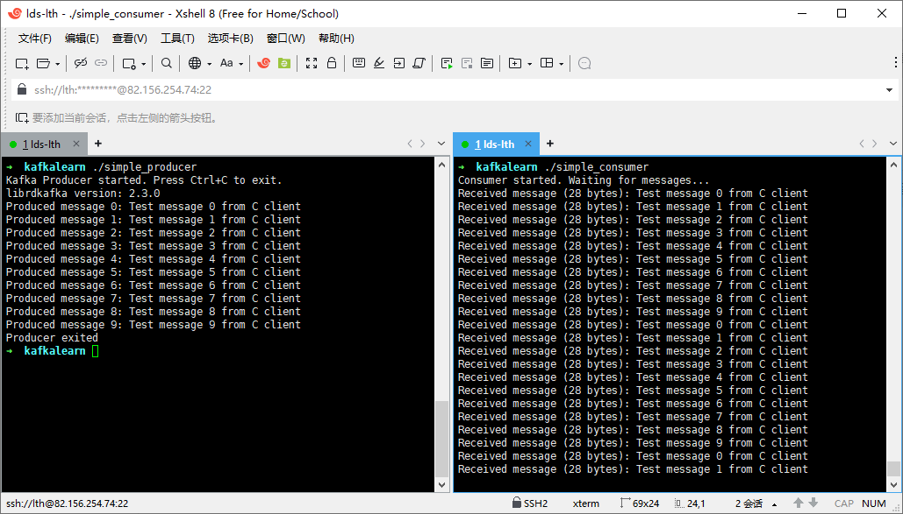

> 安装的话下载压缩包解压安装就行, 在服务器上后台运行后就可以正常使用了.

### 简易生产者

```cpp
// simple_producer.c
#include <librdkafka/rdkafka.h>
#include <stdio.h>
#include <signal.h>
#include <string.h>

static volatile sig_atomic_t run = 1;

static void stop(int sig) {
    run = 0;
}

int main() {
    rd_kafka_t *producer;
    rd_kafka_conf_t *conf;
    char errstr[512];
    
    // 创建配置对象
    conf = rd_kafka_conf_new();
    
    // 设置 broker 地址
    if (rd_kafka_conf_set(conf, "bootstrap.servers", 
                          "localhost:9092", 
                          errstr, sizeof(errstr)) != RD_KAFKA_CONF_OK) {
        fprintf(stderr, "Config error: %s\n", errstr);
        return 1;
    }
    
    // 创建生产者实例
    producer = rd_kafka_new(RD_KAFKA_PRODUCER, conf, errstr, sizeof(errstr));
    if (!producer) {
        fprintf(stderr, "Failed to create producer: %s\n", errstr);
        return 1;
    }
    
    // 信号处理
    signal(SIGINT, stop);
    signal(SIGTERM, stop);
    
    printf("Kafka Producer started. Press Ctrl+C to exit.\n");
    printf("librdkafka version: %s\n", rd_kafka_version_str());
    
    int message_count = 0;
    while (run && message_count < 10) {
        char msg[256];
        snprintf(msg, sizeof(msg), "Test message %d from C client", message_count);
        
        rd_kafka_resp_err_t err = rd_kafka_producev(
            producer,
            RD_KAFKA_V_TOPIC("test"),
            RD_KAFKA_V_VALUE(msg, strlen(msg)),
            RD_KAFKA_V_END
        );
        
        if (err) {
            fprintf(stderr, "Failed to produce message %d: %s\n", 
                    message_count, rd_kafka_err2str(err));
        } else {
            printf("Produced message %d: %s\n", message_count, msg);
        }
        
        // 轮询以处理回调
        rd_kafka_poll(producer, 1000);
        message_count++;
        
        sleep(1);
    }
    
    // 确保所有消息都发送完成
    rd_kafka_flush(producer, 5000);
    
    // 清理
    rd_kafka_destroy(producer);
    
    printf("Producer exited\n");
    return 0;
}
```

- rd_kafka_conf_t : 存放kafka的标准配置, 如`bootstrap.servers`(集群入口点)等.

- rd_kafka_new : 接管rd_kafka_conf_t的所有权, 并且传入`RD_KAFKA_PRODUCER`表示生产者.

- rd_kafka_producev : 消息发送函数.

  ```cpp
  rd_kafka_producev(
      producer,
      RD_KAFKA_V_TOPIC("test"),           // 主题名
      RD_KAFKA_V_VALUE(msg, strlen(msg)), // 消息值
      RD_KAFKA_V_KEY("key1", 4),         // 可选：消息键
      RD_KAFKA_V_HEADER("hdr1", "val1"), // 可选：消息头
      RD_KAFKA_V_PARTITION(0),           // 可选：指定分区
      RD_KAFKA_V_TIMESTAMP(1234567890),  // 可选：时间戳
      RD_KAFKA_V_END                      // 结束标记
  )
  ```

  - 消息键: 相同的消息键一定会分到统一分区, 如果数据之间有关联或经常被一块取出, 设置消息键可以让读取更加快速.
  - 消息头 : 存放元数据, 本质就是自定义的数据键值, 可以用于帮助业务处理和理解.

### 简易消费者

```cpp
// simple_consumer.c
#include <librdkafka/rdkafka.h>
#include <stdio.h>
#include <signal.h>
#include <string.h>

static volatile sig_atomic_t run = 1;

static void stop(int sig) {
    run = 0;
}

int main() {
    rd_kafka_t *consumer;
    rd_kafka_conf_t *conf;
    rd_kafka_topic_partition_list_t *subscription;
    char errstr[512];
    
    // 创建配置
    conf = rd_kafka_conf_new();
    
    // 设置配置
    rd_kafka_conf_set(conf, "bootstrap.servers", "localhost:9092", 
                      errstr, sizeof(errstr));
    rd_kafka_conf_set(conf, "group.id", "c-test-group", 
                      errstr, sizeof(errstr));
    rd_kafka_conf_set(conf, "auto.offset.reset", "earliest", 
                      errstr, sizeof(errstr));
    rd_kafka_conf_set(conf, "enable.auto.commit", "true", 
                      errstr, sizeof(errstr));
    rd_kafka_conf_set(conf, "session.timeout.ms", "45000", ...);  // 45秒
	rd_kafka_conf_set(conf, "heartbeat.interval.ms", "3000", ...); // 3秒心跳
    
    // 创建消费者
    consumer = rd_kafka_new(RD_KAFKA_CONSUMER, conf, errstr, sizeof(errstr));
    if (!consumer) {
        fprintf(stderr, "Failed to create consumer: %s\n", errstr);
        return 1;
    }
    
    // 订阅 topic
    subscription = rd_kafka_topic_partition_list_new(1);
    rd_kafka_topic_partition_list_add(subscription, "test", -1);
    
    if (rd_kafka_subscribe(consumer, subscription) != RD_KAFKA_RESP_ERR_NO_ERROR) {
        fprintf(stderr, "Failed to subscribe\n");
        rd_kafka_destroy(consumer);
        return 1;
    }
    
    rd_kafka_topic_partition_list_destroy(subscription);
    
    // 信号处理
    signal(SIGINT, stop);
    
    printf("Consumer started. Waiting for messages...\n");
    
    // 消费消息
    while (run) {
        rd_kafka_message_t *msg = rd_kafka_consumer_poll(consumer, 1000);
        
        if (msg) {
            if (msg->err) {
                if (msg->err == RD_KAFKA_RESP_ERR__PARTITION_EOF) {
                    printf("Reached end of partition\n");
                } else {
                    fprintf(stderr, "Consumer error: %s\n", 
                            rd_kafka_message_errstr(msg));
                }
            } else {
                printf("Received message (%zd bytes): %.*s\n",
                       msg->len, (int)msg->len, (char *)msg->payload);
            }
            
            rd_kafka_message_destroy(msg);
        }
    }
    
    // 关闭消费者
    rd_kafka_consumer_close(consumer);
    rd_kafka_destroy(consumer);
    
    printf("Consumer exited\n");
    return 0;
}
```

- 核心配置 : 

  - `group.id` : 设置消费者组ID.
  - `auto.offset.reset` : 位移读取策略.
  - `heartbeat.interval.ms` : 心跳.
  - `session.timeout.ms` : 会话超时时间.
    - earliest：从最早可用的消息开始（从头消费）
    - latest：从最新消息开始（跳过历史消息）, 用于实时应用

- 传入`RD_KAFKA_CONSUMER`构建消费者句柄.

- `rd_kafka_topic_partition_list_t` : 存储当前消费者订阅的主题和分区.

- `rd_kafka_topic_partition_list_add` :  填入想要订阅的topic和partition, partition为-1时代表订阅所有分区.

- rd_kafka_consumer_poll : 用来轮询拉取订阅的消息, 拉取一条消息返回.

- `rd_kafka_message_t` : 

  ```cpp
  typedef struct rd_kafka_message_s {
      rd_kafka_resp_err_t err;   // 错误码
      rd_kafka_topic_t *rkt;     // 主题对象
      int32_t partition;         // 分区号
      void *payload;            // 消息体指针
      size_t len;               // 消息体长度
      void *key;                // 键指针
      size_t key_len;           // 键长度
      int64_t offset;           // 消息位移
      rd_kafka_headers_t *headers;  // 消息头
      // ... 其他字段
  } rd_kafka_message_t;
  ```

  这里其实传递的消息结构就非常灵活了, 可以是任何的结构体形式.



### 生产环境级别的消费者

一般来说, 生产者对于kafka的使用比较简单, 使用api就可以满足大部分情况, 在客户端上使用. 

而消费者一般都是搭载在服务器上, 需要接收的任务和处理的任务数量是极高的, 因此需要有更合理的设计, 比如引入线程池, 事务回滚, 状态检查之类的设计, 其实本质就是围绕kafka的消费者接口做性能优化, 这就非常自由了, 下面只是ai出来的可能的生产环境的消费者结构 : 

```cpp
// production_consumer_architecture.c
#include <librdkafka/rdkafka.h>
#include <pthread.h>
#include <semaphore.h>
#include <time.h>
#include <sqlite3.h>  // 状态存储
#include <curl/curl.h> // HTTP通知
#include <jansson.h>   // JSON处理

// ================= 核心数据结构 =================
typedef struct {
    int consumer_id;
    char group_id[256];
    
    // 线程管理
    pthread_t poll_thread;      // 轮询线程
    pthread_t worker_threads[8]; // 工作线程
    pthread_t monitor_thread;   // 监控线程
    
    // 消息队列（消费者内部）
    MessageQueue *input_queue;
    MessageQueue *output_queue;
    MessageQueue *dead_letter_queue;
    
    // 连接池
    DatabasePool *db_pool;      // 数据库连接池
    RedisPool *redis_pool;      // Redis连接池
    HttpClientPool *http_pool;  // HTTP连接池
    
    // 状态管理
    PartitionState *partition_states[100];  // 分区状态
    CheckpointManager *checkpoints;         // 检查点管理器
    StateStore *state_store;                // 状态存储（SQLite/Redis）
    
    // 监控
    MetricsCollector *metrics;
    AlertManager *alerts;
    AuditLogger *audit_log;
    
    // 控制标志
    volatile sig_atomic_t running;
    volatile sig_atomic_t paused;
    int in_rebalance;
    
    // 统计
    time_t start_time;
    long long messages_processed;
    long long messages_failed;
} ProductionConsumer;

// ================= 主消费者线程 =================
void* consumer_main_thread(void *arg) {
    ProductionConsumer *consumer = (ProductionConsumer *)arg;
    
    // 1. 初始化
    consumer->start_time = time(NULL);
    init_connection_pools(consumer);
    load_saved_state(consumer);
    
    // 2. 创建Kafka消费者
    rd_kafka_conf_t *conf = create_production_config(consumer);
    rd_kafka_t *kafka_consumer = rd_kafka_new(RD_KAFKA_CONSUMER, 
                                             conf, errstr, sizeof(errstr));
    
    // 3. 设置回调
    rd_kafka_conf_set_rebalance_cb(conf, production_rebalance_cb);
    rd_kafka_conf_set_offset_commit_cb(conf, offset_commit_cb);
    rd_kafka_conf_set_error_cb(conf, error_cb);
    
    // 4. 订阅topic
    rd_kafka_subscribe(kafka_consumer, NULL);
    
    // 5. 启动工作线程
    start_worker_threads(consumer);
    
    // 6. 主循环
    while (consumer->running) {
        rd_kafka_message_t *msg = rd_kafka_consumer_poll(kafka_consumer, 100);
        
        if (msg) {
            if (!msg->err) {
                // 放入处理队列
                enqueue_message(consumer->input_queue, msg);
                
                // 监控
                consumer->metrics->increment("messages.received");
            } else {
                handle_kafka_error(msg->err, msg);
            }
            
            // 注意：不在这里销毁消息，工作线程会处理
        }
        
        // 检查健康状态
        check_consumer_health(consumer);
    }
    
    // 7. 优雅关闭
    graceful_shutdown(consumer, kafka_consumer);
    
    return NULL;
}

// ================= 工作线程 =================
void* worker_thread_func(void *arg) {
    WorkerContext *ctx = (WorkerContext *)arg;
    ProductionConsumer *consumer = ctx->consumer;
    
    while (consumer->running) {
        // 1. 从队列获取消息
        KafkaMessage *msg = dequeue_message(consumer->input_queue, 1000);
        if (!msg) continue;
        
        // 2. 获取数据库连接
        DatabaseConnection *db = acquire_db_connection(consumer->db_pool);
        
        // 3. 开始事务
        begin_transaction(db);
        
        try {
            // 4. 解析消息
            BusinessData *data = parse_business_message(msg);
            
            // 5. 业务处理
            process_business_logic(data, db, consumer);
            
            // 6. 提交事务
            commit_transaction(db);
            
            // 7. 记录成功
            consumer->metrics->increment("messages.processed");
            consumer->messages_processed++;
            
        } catch (Exception *e) {
            // 8. 回滚事务
            rollback_transaction(db);
            
            // 9. 记录失败
            consumer->metrics->increment("messages.failed");
            consumer->messages_failed++;
            
            // 10. 死信队列
            send_to_dead_letter_queue(msg, e);
            
            // 11. 告警
            if (should_alert(e)) {
                consumer->alerts->send("PROCESSING_ERROR", e);
            }
        }
        
        // 12. 释放资源
        release_db_connection(db);
        free_kafka_message(msg);
    }
    
    return NULL;
}
```

### 自定义分区策略

所谓分区策略就是**新消息要放到哪个分区中去处理**, 默认方式是轮询分区, 也就是每个分区轮流接收. 这种策略可以很好地做到**负载均衡**, 但是这种方式并没有指定性, 也就是说, 如果一些消息处理是有**顺序性**的话, 那么是有问题的.

举个例子, 如果一个用户发布了两个消息A和B, 需求上A要比B先处理, 那么如果是轮询负载, 就会发布到分区0和分区1, 但是分区1的消费者可能比分区0的消费提前消费, 那么就会产生问题.

- 可以使用**自定义的哈希分区**来解决, 下面只给出简略的代码, 可以更加深入.

  ```cpp
  // 实现自定义分区器
  int32_t my_partitioner(const rd_kafka_topic_t *rkt,
                         const void *keydata, size_t keylen,
                         int32_t partition_cnt,
                         void *rkt_opaque,
                         void *msg_opaque) {
      // 自定义分区逻辑
      if (keydata) {
          // 按 key 的哈希值分区
          unsigned int hash = 0;
          for (size_t i = 0; i < keylen; i++) {
              hash = ((hash << 5) + hash) + ((const char*)keydata)[i];
          }
          return hash % partition_cnt;
      }
      // 轮询分区
      static int32_t counter = 0;
      return counter++ % partition_cnt;
  }
  
  // 在生产者中设置自定义分区器
  rd_kafka_topic_conf_set_partitioner_cb(conf, my_partitioner);
  ```

### 重平衡机制

重平衡上一章已经有涉及, 本质就是**kafka服务器为了应对消费者数量变化而实现的分区分配机制**. 

虽然分配机制我们无法影响, 但是我们可以通过设置重平衡回调来对于分区变化进行**响应**.

```cpp
rd_kafka_conf_set_rebalance_cb(conf, rebalance_cb);
```

- **那么为什么消费者要对于分区变化进行响应呢?**

  我一开始觉得分区变化不影响消费者消费, 毕竟一个topic中的消息都是类型一致的, 但是这其实有违kafka的设计理念.

  在kafka的设计中partition(分区)是要被**并行处理**的, 这样其实是需要消费者**基于分区进行消费**的. 因此**资源就应该以分区为单位分配**, 如果所有分区共享资源, 那么相互竞争资源就没办法体现分区并行处理的优势了!

  在分区的消费过程中, 我们会有很多额外的需求, 比如 :

  - 状态维护 : 记录当前分区处理的消费数目, 处理时间, 处理详情等等.
  - 连接绑定 : 每个分区都可以绑定自己的数据库连接, reids连接, socket连接等等.

  这些都是我们需要维护针对分区维护的"资源".

在知道为什么需要响应后, 我们来了解如何响应, 下面是重平衡回调的固定参数 : 

```cpp
void rebalance_cb(rd_kafka_t *rk,                     // 消费者实例
                  rd_kafka_resp_err_t err,            // 重平衡事件类型
                  rd_kafka_topic_partition_list_t *partitions,  // 分区列表
                  void *opaque);                       // 用户自定义数据
```

- rd_kafka_t : 消费者实例, 用来接收新分配, 释放当前分配和提交偏移量, 这些都是要消费者手动调用的.
- rd_kafka_resp_err_t : 事件类型, 用来判断是获得新分区还是失去旧分区.
- rd_kafka_topic_partition_list_t : 可以获取当前具体的分区信息, 可以利用分区信息的唯一性 写日志 / 申请资源 / 释放资源.
- opaque : 自定义结构, 可以存放连接资源等等.

下面是一个非常简易的重平衡回调例子 : 

```cpp
void rebalance_cb(rd_kafka_t *rk,                   
                  rd_kafka_resp_err_t err,          
                  rd_kafka_topic_partition_list_t *partitions,  
                  void *opaque) {              
    
    SimpleContext *ctx = (SimpleContext *)opaque;  // 1. 获取你的上下文
    
    if (err == RD_KAFKA_RESP_ERR__ASSIGN_PARTITIONS) {  // 2. 判断事件类型
       	// 获得分区 
        for (int i = 0; i < partitions->cnt; i++) {  // 3. 遍历分区列表
            rd_kafka_topic_partition_t *p = &partitions->elems[i];
            p->offset = ...;  // 设置起始偏移
            // 申请分区资源等等
        }
        
        rd_kafka_assign(rk, partitions);  // 4. 控制消费者：接受分配
        
    } else if (err == RD_KAFKA_RESP_ERR__REVOKE_PARTITIONS) {
        // 失去分区
        rd_kafka_commit(rk, partitions, 1);  // 提交到Kafka
        rd_kafka_assign(rk, NULL);           // 释放分配
        // 释放分区资源等等
    }
}
```

需要注意的是在自定义的重平衡回调中是必须要调用`rd_kafka_assign`来接受和释放分配的, 并且也要使用`rd_kafka_commit`提交当前读取的偏移量到kafka服务器上, 不然是无法正常运行的!

当然如果不设置回调, 也会有一个最简易的默认回调, 该回调中就只有对于`rd_kafka_assign`和`rd_kafka_commit`的调用了.
